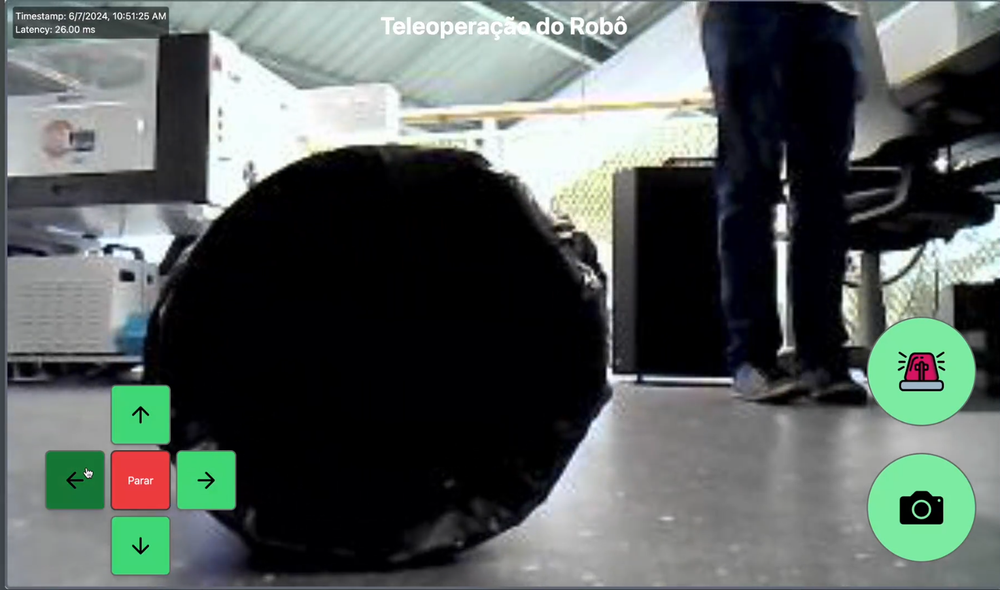
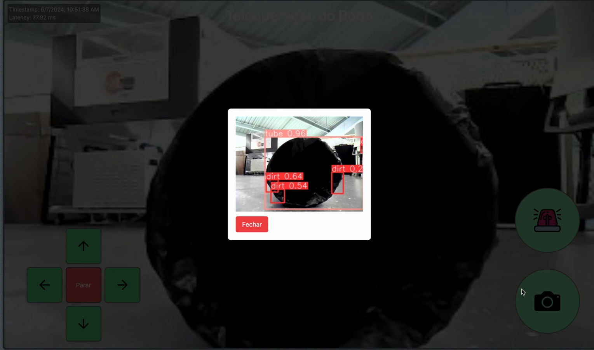

# Tacomaré

<p align="center">
<a href= "https://www.inteli.edu.br/"> </a>
</p>


## 🧑‍🎓Integrantes:

<div align="center">
  <table>
    <tr>
        <td align="center"><a href="https://www.linkedin.com/in/antonio-guimar%C3%A3es-2bb961264/?utm_source=share&utm_campaign=share_via&utm_content=profile&utm_medium=ios_app"><br><sub><b>Antônio Guim.</b></sub></a></td>
        <td align="center"><a href="https://www.linkedin.com/in/breno-santos-0843131b8/"><br><sub><b>Breno Santos</b></sub></a></td>
        <td align="center"><a href="https://www.linkedin.com/in/gabrielle-mitoso/"><br><sub><b>Gabrielle Mit.</b></sub></a></td>
        <td align="center"><a href="https://www.linkedin.com/in/gabriel-gallo-m-coutinho-443809232/"><br><sub><b>Gabriel Gallo</b></sub></a></td>
        <td align="center"><a href="https://www.linkedin.com/in/luan-ramos-de-mello-253b28268/"><br><sub><b>Luan Ramos</b></sub></a></td>
        <td align="center"><a href="https://www.linkedin.com/in/rafaelarojas/"><br><sub><b>Rafaela Rojas</b></sub></a></td>
    </tr>
  </table>
</div>

## 🧑‍🏫Professores:

### Orientador(a)
<a href="#"> Rodrigo Mangoni Nicola </a>

### Instrutores

- <a href="#"> Geraldo Vasconcelos </a>
- <a href="#"> Guilherme Henrique de Oliveira Cestari </a>
- <a href="#"> Lisane Valdo </a>
- <a href="#"> Mônica Anastassiu </a>
- <a href="#"> Murilo Zanini de Carvalho </a>

---

## 📝Descrição 

📜| Este projeto desenvolvido para a Atvos utiliza inteligência artificial (IA) e um robô turtlebot para realizar a inspeção dos tubos dos reboilers na produção de açúcar de cana. Através de uma abordagem dupla, nossa solução busca identificar obstruções que possam comprometer a eficiência do processo.





A solução consiste em uma câmera endoscópica percorre o interior dos tubos. Esta câmera, equipada com o modelo de IA YOLO, analisa as imagens capturadas para detectar visualmente quaisquer sinais de entupimento. A combinação destas tecnologias permite uma avaliação abrangente e precisa do estado dos tubos, garantindo uma operação mais estável e eficiente.

Para ler toda a documentação do projeto, [clique aqui](https://inteli-college.github.io/2024-1B-T08-EC06-G04/)

---


##  Estrutura de pastas

```
└── documentacao
│   ├── blog
│   ├── docs
|   │   ├── sprint-1
|   │   │   ├── Arquitetura
|   │   │   ├── Entedimento
|   │   │   ├── Metadesign
|   │   ├── sprint-2
|   │   │   ├── Documentação
|   │   ├── sprint-3 
|   │   │   ├── Documentação
|   │   ├── sprint-4 
|   │   │   ├── Documentação
|   │   │   │   ├── Backend
|   │   │   │   ├── Instruções de uso
|   │   │   │   ├── Metodologia
|   │   ├── sprint-5
|   │   │   ├── Documentação
|   │   │   │   ├── Instruções de uso
|   │   │   │   ├── Metodologia
|   │   └── intro.md
│   ├── src
|   │   ├── components
|   │   ├── css
|   │   └── pages
│   └── static
└── src
│   ├── backend
│   ├── project_ws
│   ├── react
│   ├── visor
├── LICENSE
├── README.md
```

---

## 💻Inicialização

Afim de inicializar a CLI para comunicação com o robô deve-se fazer o seguinte:

#### Setup do robo para escutar publish:

Para realizar o setup inicial do robo para "escutar" os movimentos deve-se executar o seguinte em seu terminal:

Se seu terminal for .bash

```bash
cd 2024-1B-T08-EC06-G04

./exec2_bash.sh
```

Se seu terminal for .zsh

```bash
cd 2024-1B-T08-EC06-G04

./exec2_zsh.sh
```

#### Inicializaçõa da CLI:

Para inicializar a interface CLI, se seu terminal for .bash, execute o seguinte no seu terminal na respectiva ordem:

```bash
cd 2024-1B-T08-EC06-G04

./exec_bash.sh
```

Já, se seu terminal for .zsh, execute os seguinte códigos no terminal:

```bash
cd 2024-1B-T08-EC06-G04

./exec_zsh.sh
```

### Workspace ROS

---

## 📋Histórico de lançamentos

- 0.1.0 - 26/04/2024
  - Entendimento do negócio
  - Arquitetura do sistema
  - Metadesign
  - Identidade visual do grupo
- 0.2.0 - 10/05/2024
  - Interface simplificada (CLI)
  - Movimentos do robô
  - Sistema de emergência
  - Metodologia
  - Instruções para execução
- 0.3.0 - 24/04/2024
  - Adição do **Lidar**
  - Adição da **Câmera**
  - Análise financeira
  - Primeira versão da UI
- 0.4.0 - 07/05/2024
  - Modelo de **visão computacional**
  - Banco de dados
  - API e Backend
  - Teste de funcionalidade
  - Instruções de execução
  - Metodologia atualizadas
- 0.5.0 - 21/05/2024
  - Arrumar o **Kill Switch**
  - Página com os dados
  - Atualização das instruções de execução
  - Atualização metodologia atual.

# 🗃Licença/License

<p xmlns:cc="http://creativecommons.org/ns#" xmlns:dct="http://purl.org/dc/terms/"><a property="dct:title" rel="cc:attributionURL" href="https://github.com/Inteli-College/2024-T0008-EC05-G03">GRUPO 4</a> by <a rel="cc:attributionURL dct:creator" property="cc:attributionName">Inteli, - <a href="https://www.linkedin.com/in/antonio-guimar%C3%A3es-2bb961264/?utm_source=share&utm_campaign=share_via&utm_content=profile&utm_medium=ios_app">Antonio Guimarães</a>, <a href="https://www.linkedin.com/in/antonio-guimar%C3%A3es-2bb961264/?utm_source=share&utm_campaign=share_via&utm_content=profile&utm_medium=ios_app">Breno Santos</a>, <a href="https://www.linkedin.com/in/gabrielle-mitoso/">Gabrielle Mitoso</a>, <a href="https://www.linkedin.com/in/gabriel-gallo-m-coutinho-443809232/">Gabriel Gallo</a>, <a href="https://www.linkedin.com/in/luan-ramos-de-mello-253b28268/">Luan Ramos</a>, <a href="https://www.linkedin.com/in/rafaelarojas/">Rafaela Rojas</a>, </a> is licensed under <a href="http://creativecommons.org/licenses/by/4.0/?ref=chooser-v1" target="_blank" rel="license noopener noreferrer" style="display:inline-block;">Attribution 4.0 International</a>.</p>
