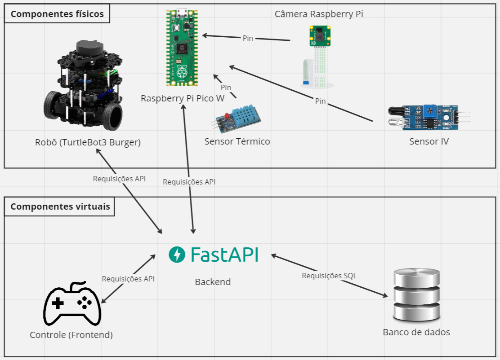

# Proposta Inicial da Arquitetura

&emsp;&emsp; A proposta inicial da arquitetura da solução foi decidida pelo grupo Tacomaré com base nas duas conversas que foram feitas com a Atvos. Ela consiste em um robô que executa uma rotina de verificação definida no backend, medindo a temperatura, a intensidade luminosa (no infra-vermelho) e tirando uma foto do cano, assim, depois de enviar para o backend, um algoritmo de inteligência artificial processa os dados e determina caso o cano o qual foi verificado está entupido ou não.

&emsp;&emsp; Para que o cliente acesse os dados, ele deve fazer as requisições corretas na API que iremos desenvolver e caso um colaborador tenha que controlar o trajeto do robô, ele poderá fazer isso dinâmicamente com um site que age como um controle auxiliar do robô. A arquitetura irá evoluir conforme o desenvolvimento do projeto, porém, a proposta inicial da arquitetura pode ser visualizada como:

## Módulos utilizados

- Robô (TurtleBot3 Burger): componente físico principal, responsável pelo movimento e fornece o ambiênte e energia para os outros componentes físicos
- Raspberry Pi Pico W: microcontrolador adicional para receber os dados dos sensores externos e enviar os dados coletados para o backend da aplicação
- Sensor térmico: componente do sistema físico que mede temperatura, pressão e umidade do ambiente e retorna para o Raspberry Pi
- Câmera Raspberry Pi: componente físico responsável por registrar uma foto do cano no Raspberry Pi para ser avaliada 
- Sensor IV (infra-vermelho): componente externo que mede a intensidade luminosa de luz no espectro infra-vermelho e retorna para o Raspberry Pi
- Banco de dados: parte do software responsável por armazenar os dados necessários para o funcionamento do sistema
- Backend: o cérebro da solução, responsável por conectar os elementos entre si e processar os dados medidos
- Controle (frontend): estrutura web que comunica com o backend para assumir o controle do movimento do robô 

## Integração entre módulos

&emsp;&emsp; Para a comunicação entre os módulos que serão utilizados, temos dois tipos de requisição e um tipo de comunicação física, sendo eles:

- Requisição Web (MQTT, HTTP, etc): esse tipo de requisição conecta o robô, o controle e o microcontrolador com o backend da aplicação e ela utiliza de chamadas a distância para a comunicação entre os módulos
- Requisição SQL: é um pedido ao banco de dados que facilita sua alteração ou leitura. Será utilizada entre o backend e o banco de dados para comunicar alterações e organizar os dados
- Ligação física: consiste na conexão física entre elementos, transmitindo a informação por meio de cabos entre os módulos. Será utilizado para conectar os módulos adicionais(camera e sensores) com o microprocessador