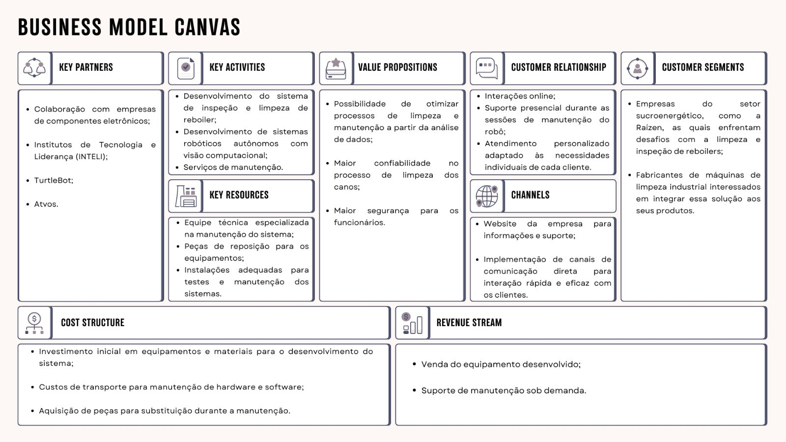

# Business Model Canvas

&emsp; O Business Model Canvas (Quadro de Modelo de Negócios)  é uma ferramenta de planejamento estratégico utilizada por gestores para ilustrar e desenvolver o modelo de negócios. O modelo de canvas do modelo de negócios identifica claramente os elementos-chave que compõem um negócio. Além disso, simplifica um plano de negócios em uma forma condensada. Dessa forma, o modelo de canvas do modelo de negócios atua como um resumo executivo para o plano de negócios.[1]

&emsp; Canvas é composto por nove blocos principais que representam os componentes essenciais de um modelo de negócios:

1. Proposta de Valor (Value Propositions):
&emsp;A Proposta de Valor descreve os benefícios específicos que um produto ou serviço oferece aos clientes. Ela explica por que os produtos ou serviços são valiosos para os clientes, destacando os problemas que são resolvidos ou as necessidades que são atendidas. Uma Proposta de Valor sólida é fundamental para diferenciar a oferta da empresa da concorrência e atrair clientes. [2]

2. Segmentação de Clientes (Customer Segments):
&emsp;A Segmentação de Clientes é o processo de dividir a base de clientes em grupos distintos com características semelhantes, como comportamento de compra, necessidades, preferências e demografia. Isso permite que a empresa compreenda melhor seus clientes e adapte suas estratégias de marketing e vendas para atender às necessidades específicas de cada segmento.[2]

3. Canais (Channels):
&emsp; Os Canais referem-se aos diferentes meios pelos quais uma empresa alcança, interage e vende para seus clientes. Isso pode incluir canais online (como website, redes sociais, e-commerce), canais físicos (lojas físicas, distribuidores) e outros métodos de comunicação e venda. A escolha dos canais certos é crucial para alcançar os clientes de maneira eficaz.[2]

4. Atividades-Chave (Key Activities):
&emsp; As Atividades-Chave são as tarefas essenciais que uma empresa realiza para oferecer sua Proposta de Valor aos clientes e gerar receita. Isso pode incluir atividades de produção, marketing, vendas, entrega e suporte ao cliente. Identificar e priorizar as Atividades-Chave é fundamental para a eficiência operacional e o sucesso do negócio.[2]

5. Recursos-Chave (Key Resources):
&emsp; Os Recursos-Chave são os ativos necessários para operar o negócio e oferecer valor aos clientes. Isso pode incluir recursos físicos (instalações, equipamentos), recursos intelectuais (propriedade intelectual, conhecimento especializado) e recursos humanos (equipe qualificada). Gerenciar e otimizar os Recursos-Chave é essencial para o funcionamento eficaz do modelo de negócio.[2]

6. Parceiros-Chave (Key Partners):
&emsp; Os Parceiros-Chave são empresas, fornecedores ou organizações externas com as quais a empresa estabelece parcerias estratégicas para apoiar suas atividades-chave e agregar valor aos clientes. Isso pode incluir parceiros de fornecimento, co-desenvolvimento, marketing ou distribuição. Parcerias sólidas podem ampliar as capacidades da empresa e oferecer acesso a recursos adicionais.[2]

7. Estrutura de Custos (Cost Structures):
&emsp; A Estrutura de Custos descreve todos os custos associados à operação do modelo de negócio. Isso inclui custos fixos (aluguel, salários) e custos variáveis (matérias-primas, marketing), bem como investimentos em desenvolvimento e manutenção do negócio. Gerenciar a Estrutura de Custos de forma eficiente é crucial para garantir a rentabilidade e sustentabilidade financeira.[2]

8. Relacionamento com Cliente (Customer Relationship):
&emsp; O relacionamento com os clientes refere-se à estratégia usada pela empresa para se envolver com seu público-alvo. Isso inclui como a empresa se comunica, mantém e fortalece as relações com os clientes ao longo de todo o ciclo de vendas e após a conclusão da venda.

9. Fluxos de Receita (Revenue Streams):
&emsp; Os Fluxos de Receita são as diferentes maneiras pelas quais uma empresa gera receita a partir de sua Proposta de Valor. Isso pode incluir vendas diretas, subscrições, licenciamento, publicidade, serviços adicionais ou modelos de negócio inovadores. Diversificar os Fluxos de Receita pode ajudar a mitigar riscos e maximizar as oportunidades de geração de receita.[2]

No contexto do projeto, podemos identificar os seguintes aspectos em cada área do Business Model Canvas:

1. Proposta de Valor:
- Possibilidade de otimizar processos de limpeza e manutenção a partir da análise de dados;
- Maior confiabilidade no processo de limpeza dos canos;
- Maior segurança para os funcionários.

2. Segmentação de Clientes:
- Empresas do setor sucroenergético, como a Raízen, as quais enfrentam desafios com a limpeza e inspeção de reboilers;
- Fabricantes de máquinas de limpeza industrial interessados em integrar essa solução aos seus produtos.

3. Canais:
- Website da empresa para informações e suporte;
- Implementação de canais de comunicação direta para interação rápida e eficaz com os clientes.

4. Atividades-Chave:
- Desenvolvimento contínuo do sistema de inspeção e limpeza de canos de reboiler;
- Desenvolvimento de sistemas robóticos autônomos com visão computacional;
- Serviços de manutenção.

5. Recursos-Chave:
- Equipe técnica especializada em desenvolvimento e manutenção do sistema;
- Peças de reposição para os equipamentos;
- Instalações adequadas para testes e manutenção dos sistemas.

6. Parceiros-Chave:
- Colaboração com empresas de componentes eletrônicos;
- Institutos de Tecnologia e Liderança;
- TurtleBot;
- Atvos.

7. Estrutura de Custos:
- Investimento inicial em equipamentos e materiais para o desenvolvimento do sistema.
- Custos de transporte para manutenção de hardware e software.
- Aquisição de peças para substituição durante a manutenção.

8. Relacionamento com cliente
- Interações online através das redes sociais;
- Suporte presencial durante as sessões de manutenção do robô;
- Atendimento personalizado adaptado às necessidades individuais de cada cliente.

9. Fluxos de Receita:
- Venda do equipamento desenvolvido.
- Suporte de manutenção sob demanda.

Referências:
[1] Corporate Finance Institute. Business Model Canvas Template. Disponível em: https://corporatefinanceinstitute.com/resources/management/business-model-canvas-template/. Acesso em: 25/04/2024.
[2] SEED Digital. How to: Business Model Canvas Explained. Medium, [S.l.], [2023]. Disponível em: https://medium.com/seed-digital/how-to-business-model-canvas-explained-ad3676b6fe4a. Acesso em: 25/04/2024.

