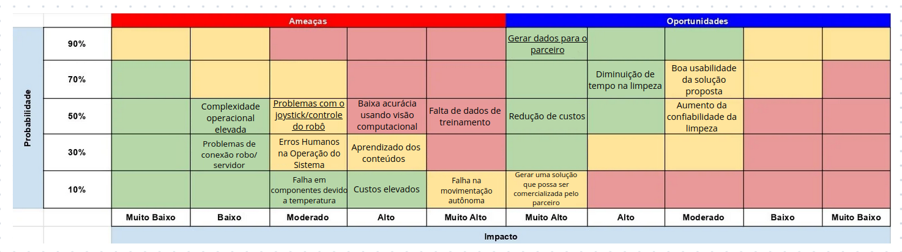

# Matriz de risco

&emsp;&emsp;A matriz de risco é uma ferramenta estratégica essencial no gerenciamento de projetos, proporcionando uma representação visual que articula a probabilidade de ocorrência de determinadas situações em relação aos potenciais impactos que essas situações podem gerar. Essa abordagem gráfica possibilita uma análise abrangente dos riscos associados a um projeto específico, permitindo uma tomada de decisão informada e proativa.

&emsp;&emsp;Ao considerar a probabilidade de ocorrência, a matriz de risco avalia a frequência com que eventos indesejados podem se materializar. Essa avaliação é representada em uma escala que varia de baixa probabilidade a alta probabilidade, oferecendo uma visão clara da possibilidade de enfrentar desafios ou oportunidades ao longo do desenvolvimento do projeto.

&emsp;&emsp;Por outro lado, a dimensão do impacto na matriz de risco refere-se às consequências que podem surgir se um determinado evento ocorrer. Essas consequências podem ser tanto positivas quanto negativas, destacando a dualidade inerente aos riscos. O impacto é geralmente categorizado em uma escala que vai desde insignificante até catastrófico, proporcionando uma compreensão aprofundada das implicações associadas a cada situação de risco.

&emsp;&emsp;A análise conjunta da probabilidade e do impacto cria quadrantes distintos na matriz de risco, categorizando os eventos em termos de sua criticidade. Os eventos com alta probabilidade e alto impacto geralmente ocupam o quadrante de "risco significativo", exigindo uma atenção especial no planejamento de estratégias de mitigação. Por outro lado, eventos com baixa probabilidade e baixo impacto podem ser classificados como "risco mínimo", permitindo uma gestão mais leve e focalizada.

&emsp;&emsp;No contexto específico de nosso projeto, a matriz de risco destaca a interseção entre a incerteza e as oportunidades, proporcionando uma base sólida para a elaboração de estratégias de gestão de riscos. Ao visualizar e compreender os possíveis desdobramentos do projeto, podemos antecipar, planejar e responder de maneira eficaz, maximizando as chances de sucesso. Em última análise, a matriz de risco é uma ferramenta valiosa que capacita as equipes de projeto a navegarem pelas complexidades inerentes ao ambiente de trabalho, garantindo uma abordagem resiliente e adaptável diante das incertezas do caminho à frente.

&emsp;&emsp;Sendo assim, a seguir tem-se a matriz de risco referente ao presente projeto:

---

## Ameaças

&emsp;&emsp;Ameaças do projeto e planos de ação para cada ameaça:

---

**Complexidade Operacional Elevada**: Esta ameaça se refere à possibilidade de a solução ser difícil de operar e exigir treinamento especializado dos usuários. 
- Planos de Ação: Desenvolver uma interface de usuário intuitiva e simplificada, fornecer treinamento abrangente para os usuários, com ênfase na facilidade de uso da solução.

**Problemas de Conexão Robô/Servidor**: Essa ameaça envolve a instabilidade na conexão entre o robô TurtleBot e o servidor, o que pode resultar em interrupções no controle remoto ou na transmissão de dados. 
- Planos de Ação: Implementar protocolos de comunicação robustos e redundância de conexão, realizar testes regulares de conectividade para identificar e resolver problemas rapidamente.

**Problemas com Joystick/Controle do Robô**:Esta ameaça indica a possibilidade de falhas no dispositivo de controle, afetando a capacidade de operar o robô de forma eficaz. 
- Planos de Ação: Selecionar um joystick de alta qualidade e confiabilidade, realizar testes de compatibilidade e desempenho antes da implementação.

**Erros Humanos na Operação do Sistema**: O risco de erros humanos durante a operação pode comprometer a eficácia e a confiabilidade da solução. 
- Planos de Ação: Desenvolver procedimentos operacionais padronizados (POPs) claros e concisos, implementar verificações de segurança e confirmações duplas em etapas críticas do processo.

**Falha em Componentes devido a Temperatura Elevada**:Componentes eletrônicos sensíveis podem falhar devido a temperaturas elevadas no ambiente operacional. 
- Planos de Ação: Realizar pesquisas de componentes que possam ficar em contato com temperaturas elevadas

**Baixa Acurácia Usando Visão Computacional**: Existe o risco de o sistema de visão computacional não ser preciso o suficiente. 
- Planos de Ação: Coletar e rotular um conjunto diversificado de dados para treinamento, realizar validação cruzada e ajuste de hiperparâmetros para melhorar o desempenho do modelo.

**Aprendizado dos Conteúdos**: O aprendizado e adaptação aos conceitos e tecnologias podem representar um desafio para a equipe. 
- Planos de Ação: Estabelecer um programa de treinamento contínuo.

---

## Oportunidades

&emsp;&emsp;Oportunidades do projeto e planos de ação para cada oportunidade para que sejam realizadas:

---

**Gerar Dados para o Parceiro**:Esta oportunidade destaca a capacidade do projeto de fornecer dados valiosos para análise e tomada de decisões. 
- Planos de Ação: Implementar uma estratégia de coleta e análise de dados abrangente.

**Redução de Custos**: A oportunidade de reduzir os custos operacionais e de manutenção é fundamental para aumentar a viabilidade econômica da solução. 
- Planos de Ação: Identificar áreas de otimização de custos ao longo do ciclo de vida do projeto, realizar pesquisas de quais componentes mais em conta o parceiro pode implementar para que a eficiência não se perca.

**Gerar uma Solução que Possa ser Comercializada pelo Parceiro**: Desenvolver uma solução comercializável agrega valor ao projeto e ao parceiro. 
- Planos de Ação: Colaborar com o parceiro para entender suas necessidades e requisitos de mercado, deixar o MVP alinhado com planos futuros, para que a Atvos consiga prosseguir até a versão final e que possa ser vendida, visto que a solução será a primeira no mercado.

**Diminuição de Tempo na Limpeza**: Reduzir o tempo necessário para tarefas de limpeza dos reboilers aumenta a eficiência operacional. 
- Planos de Ação: Utilizar eficientemente os dados coletados e o robô para otimizar os processos de limpeza.

**Boa Usabilidade da Solução Proposta**: Garantir uma boa usabilidade, visto que os usuários são pessoas com letramento digital baixo. 
- Planos de Ação: Realizar testes de usabilidade.

**Aumento da Confiabilidade da Limpeza**: Aumentar a confiabilidade da limpeza, sabendo quais tubos ainda permanecem com resíduos e devem ser limpos novamente.
- Planos de ação: Realizar testes para conferir se a câmera com visão computacional está capturando da forma correta os resíduos.
