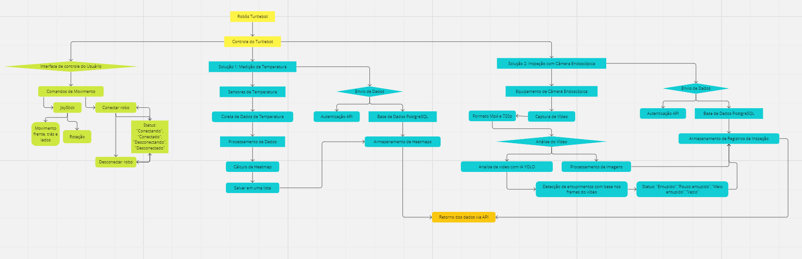
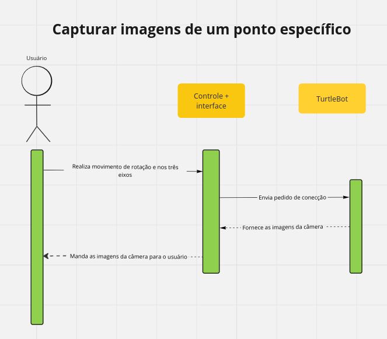
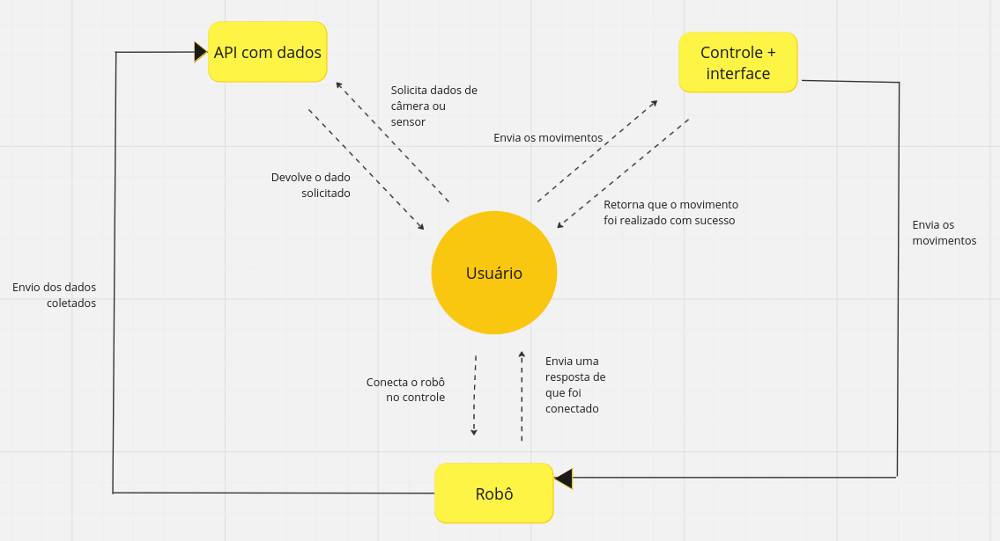

# Arquitetura de informação

&emsp;&emsp;A **arquitetura da informação** (AI) é uma disciplina do design que se concentra na organização, estrutura e rotulagem de conteúdo em sistemas de informação, como sites, aplicativos móveis e outros espaços digitais. Seu objetivo principal é criar interfaces intuitivas e eficientes que ajudem os usuários a encontrar e interagir com a informação de forma fácil e eficaz.

&emsp;&emsp;A AI é crucial para garantir que os usuários possam navegar de forma eficiente e encontrar o que estão procurando sem dificuldade. Ela aborda questões como a organização de conteúdo, a criação de esquemas de navegação claros, a rotulagem adequada de categorias e a hierarquia de informações.

&emsp;&emsp;A seguir, tem-se duas formas, com perspectivas diferentes, de representar a arquitetura de informação do projeto **Tacomaré**.

## Diagrama da solução

&emsp;&emsp;O Diagrama de solução é uma ferramenta essencial para traçar a solução completa de um sistema, de maneira visual, a fim de fornecer uma visão geral de como a solução irá funcionar e seus tipos de interação.

&emsp;&emsp;A seguir, tem-se o diagrama de solução do projeto em questão:

Figura 1 - Diagrama de solução

Fonte: Elaboração própria

&emsp;&emsp;O que está reprensentado de amarelo (duas celular iniciais superiores), é os dois principais elementos do sistema. Primeiramente, os Robôs TurtleBot, que serão utilizados para portar os sensores de temperatura e a câmera. Outro elemento essencial para o funcionamento do sistema, é o controle do robô, ferramenta utilizada para realizar possíveis movimentos do robô apenas com o controle.

&emsp;&emsp;Sabendo que, o controle será o elemento que mais será utilizado pelos usuários, em verde (núcleo à extrema esqueda da imagem), tem se a parte de visibilidade do sistema com o usuário final. É possível notar no diagrama, que a interface possui os comandos de movimento, onde encontra-se um *joystick* capaz de realizar movimentos de rotação e movimento do Robô TurtleBot. Além disso, na interface terá um feedback para o usuário ter conhecimento do status do sistema (Conectando, conectador, desconectando, desconectado), este elemento entra em conformidade com a primeira Heurística de Nielsen, "Visibilidade do Status do Sistema", que dita que o sistema deve informar ao usuário em qual ambiente ele se encontra, permitindo um maior controle dos utilizadores do sistema.

&emsp;&emsp;Em azul (núcleo maior), tem-se as duas soluções que o projeto Tacomaré irá cobrir:
- Solução 1: Medição de temperatura - A primeira solução do sistema se trata de mapear tubos que estão com resíduos durante a operação dos tanques da Atvos. Trazendo um contexto, a Atvos realiza a operação de nove meses corridos, para dar um melhor controle da limpeza dos tubos durante a operação, será implantado no TurtleBot sensores de temperatura, os dados coletados pelos sensores serão processados, e um cálculo de *Heatmap*(mapa de calor) será realizado, após isso os dados são salvos e armazenados em uma base de dados PostgresSQL.
- Solução 2: Inspeção com Câmera Endoscópica - A segunda solução foi pensada para ser utilizada durante o período fora das operações. Nesse período, que dura três meses, os funcionários da manutenção da Atvos realizam a limpeza de todos os tubos com um jato de água, a limpeza é realizada duas vezes, a segunda vez com o intuito de garantir que tudo está limpo devidamente. Nesse cenário, a solução se trata de uma câmera acoplada ao robô, que passará por debaixo dos canos e com a análise do vídeo para com a IA YOLO será feita uma detecção de entupimento com base nos frames do vídeo, após a primeira limpeza, assim a segunda limpeza será mais direcionada para os tubos que ainda possuem resíduos, gerando assim um gasto menor de água para a Atvos, além de diminuir o risco dos funcionários da manuteção e fazer com que o trabalho desses funcionários seja mais objetivo. No final da captura de imagens, todas as informações são armazenadas em uma base de dados PostgreSQL.
&emsp;&emsp;Todos os dados, de ambas soluções, são retornados via API, assim como solicitado pelo parceiro e representado no diagrama na cor laranja.

## Diagrama de sequência

&emsp;&emsp;O Diagrama de Sequência UML (Linguagem de Modelagem Unificada) é uma representação visual que delineia a interação dinâmica entre diferentes partes de um sistema durante a execução de um cenário específico. Esta ferramenta oferece uma visão sequencial das mensagens trocadas entre objetos ou componentes, destacando a ordem cronológica das ações em um processo.

&emsp;&emsp;No contexto do nosso projeto, o Diagrama de Sequência UML é uma ferramenta indispensável para demonstrar como diversos elementos, incluindo usuários, sistema, TurtleBot, sensores, câmera e banco de dados, colaboram em tempo real. Ele não apenas registra as etapas de interação, mas também evidencia como os diferentes componentes do sistema se comunicam para executar tarefas específicas. Ao empregar esse tipo de diagrama, conseguimos capturar de forma visual o fluxo de informações e comandos, desde a solicitação inicial do usuário até as respostas subsequentes do sistema. Isso não apenas facilita a compreensão dos processos internos, mas também estabelece uma base sólida para identificar possíveis pontos de falha ou áreas de otimização. 

&emsp;&emsp;A seguir, tem-se o diagrama de sequência do presente projeto.

Figura 2 - Diagrama de sequência: Capturar imagens de um ponto específico

Fonte: Elaboração própria

&emsp;&emsp;O diagrama acima visa fornecer uma explicação detalhada do fluxo de ações necessárias para que o usuário possa capturar imagens de um ponto específico, como um tubo em particular. Este processo é crucial para permitir que o usuário tenha uma visão abrangente da situação de todos os tubos e a quantidade de resíduos presentes neles.

&emsp;&emsp;Para alcançar esse objetivo, é essencial que o usuário possa controlar remotamente os movimentos do robô, que está equipado com uma câmera para capturar e enviar as imagens em tempo real. Este controle remoto é facilitado por meio de um dispositivo de controle, que permite ao usuário interagir com o robô.

&emsp;&emsp;Ao iniciar o processo, o usuário utiliza o dispositivo de controle para enviar comandos ao robô, direcionando-o para o ponto específico onde deseja capturar imagens, neste caso, um tubo específico. O robô, conhecido como TurtleBot, é projetado para mover-se, permitindo que alcance o local desejado com facilidade.

&emsp;&emsp;Uma vez que o TurtleBot tenha alcançado o ponto designado, a câmera embutida no robô é ativada, começando a capturar imagens do tubo em questão. Essas imagens são então transmitidas em tempo real para o dispositivo de visualização do usuário, permitindo-lhe examinar a condição do tubo e avaliar a quantidade de resíduos presentes nele.

&emsp;&emsp;Durante todo esse processo, a comunicação entre o dispositivo de controle, o robô e o dispositivo de visualização é essencial para garantir uma operação fluida e eficaz. Além disso, a capacidade do TurtleBot de movimentar-se de forma autônoma e a precisão da câmera embutida são fundamentais para garantir que as imagens capturadas sejam claras e informativas.

Figura 3 - Diagrama de sequência: Capturar temperatura de um ponto específico

Fonte: Elaboração própria

&emsp;&emsp;Este diagrama representa o processo de captura de temperatura de um ponto específico, ou seja, de um tubo. Inicialmente, o usuário utiliza um controle remoto para realizar os movimentos do robô TurtleBot. Este robô está equipado com um sensor de temperatura, capaz de medir a temperatura do tubo. Após a medição, a temperatura é registrada e enviada de volta ao usuário como um status. Esse status indica se o tubo está dentro dos parâmetros aceitáveis ou se necessita de limpeza.

&emsp;&emsp;O controle remoto permite ao usuário operar o TurtleBot de forma remota, movendo-o para diferentes locais onde a medição da temperatura do tubo é necessária. Uma vez posicionado, o sensor de temperatura do TurtleBot é acionado para realizar a medição. Essa medição é então processada internamente, e o resultado é enviado de volta ao usuário.

&emsp;&emsp;Com base na temperatura registrada, o usuário pode determinar se o tubo está funcionando dentro dos limites aceitáveis ou se há a necessidade de limpeza ou manutenção. Isso é essencial para garantir o funcionamento adequado do sistema ao qual o tubo está conectado, evitando problemas como superaquecimento ou falhas no processo.

## Diagrama de contexto

&emsp;&emsp;O Diagrama de Contexto é uma ferramenta fundamental dentro da UML (Unified Modeling Language), uma linguagem de modelagem amplamente utilizada na engenharia de software. Este diagrama é especialmente valioso no início do processo de design de sistemas, pois fornece uma visão geral simplificada das interações entre o sistema em questão e seus atores externos.

&emsp;&emsp;Em termos simples, o Diagrama de Contexto mostra o sistema como uma caixa central e todos os agentes externos (ou "atores") com os quais ele interage ao seu redor. Estes atores podem ser pessoas, sistemas externos, dispositivos de hardware, entre outros. O objetivo é capturar as relações mais importantes do sistema com o mundo exterior, sem se aprofundar nos detalhes internos de sua implementação.

&emsp;&emsp;A imagem abaixo trata-se do diagrama de contexto realizada para a solução

Figura 4 - Diagrama de contexto

Fonte: Elaboração própria

&emsp;&emsp;O diagrama representa de maneira abrangente a interação do usuário com todos os componentes do sistema. Em um primeiro momento, o usuário está em controle, emitindo comandos para o sistema, os quais são processados e retornados como confirmação de execução. Essa interação inicial estabelece a base para a operação fluida do sistema.

&emsp;&emsp;Outro ponto crucial é a interação com a API, uma interface fundamental que facilita o acesso e a comunicação com os diversos elementos do sistema. Por meio da API, o usuário pode requisitar dados específicos, como informações provenientes de câmeras ou sensores. Essa troca de dados entre o usuário e a API permite uma comunicação eficiente e versátil.

&emsp;&emsp;Adicionalmente, há a interação com o robô TurtleBot, um componente essencial que concretiza as ações solicitadas pelo usuário. A conexão entre o robô desejado e o controle é mediada por essa interação, estabelecendo uma ponte tangível entre os comandos emitidos pelo usuário e a execução física por parte do robô.

&emsp;&emsp;Por sua vez, o robô TurtleBot interage com a API, enviando os dados coletados durante sua operação. Essa interação bidirecional entre o robô e a API permite uma troca contínua de informações, possibilitando uma adaptação dinâmica às necessidades do usuário e do ambiente.

&emsp;&emsp;Por fim, o controle mantém uma interação constante com o Robô TurtleBot, coordenando e sincronizando os movimentos e ações conforme solicitado pelo usuário. Esse processo de interação contínua entre o controle e o robô garante a precisão e a eficácia na execução das tarefas designadas.

---

Todos os diagramas podem ser visualizados mais detalhadamente [aqui](https://miro.com/app/board/uXjVKPzRjuQ=/)