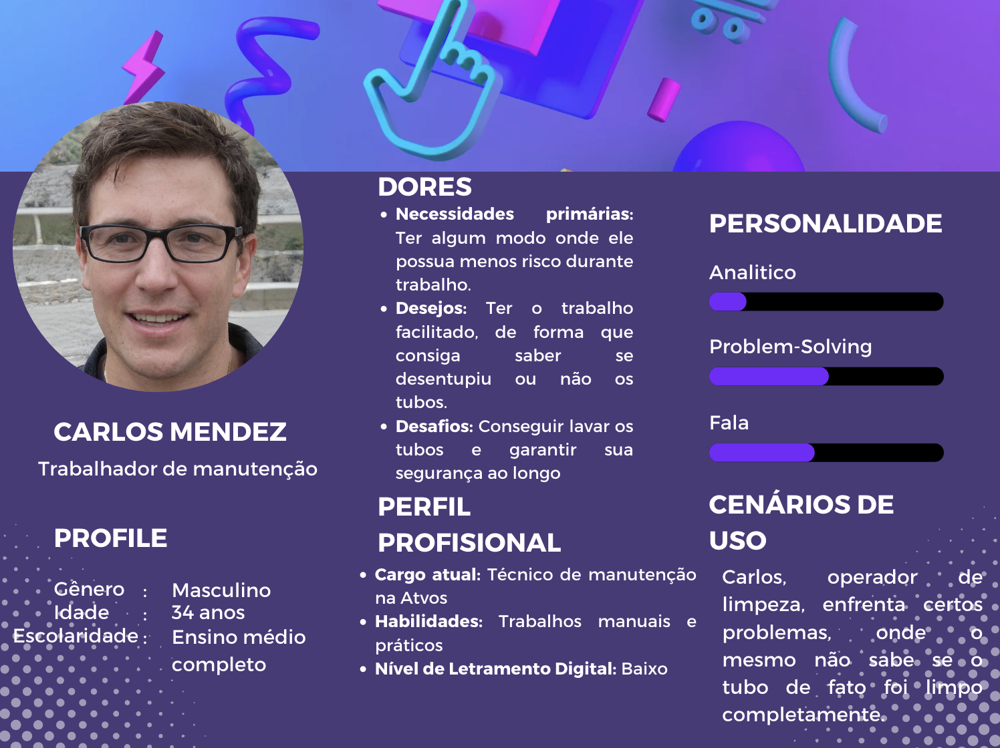
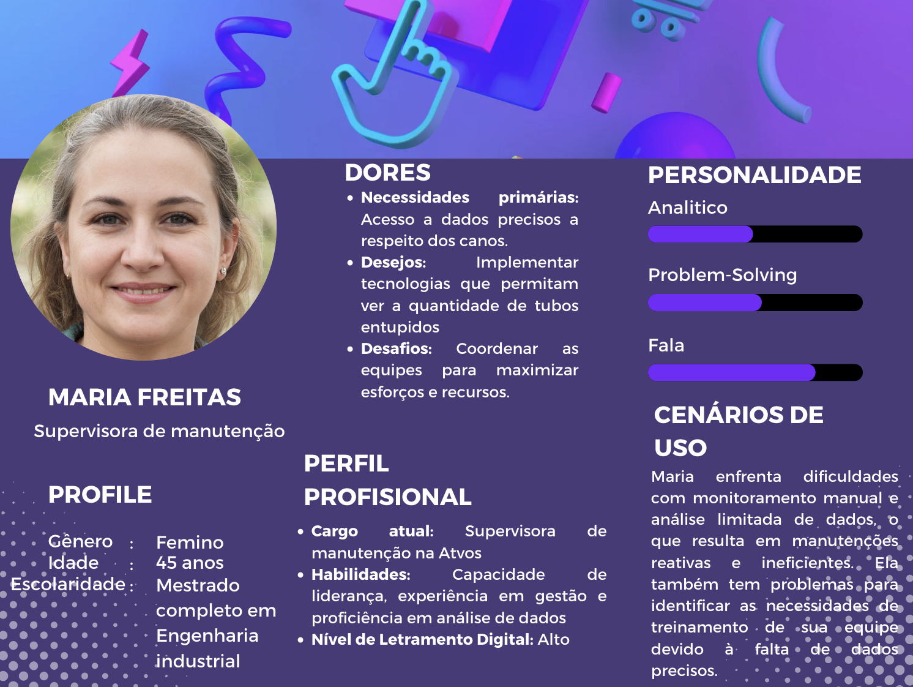

# Introdução às Personas no Design de Projetos

&emsp;&emsp; No universo do design de projetos e experiência do usuário, personas são personagens fictícios criados para representar diferentes tipos de usuários dentro de um demográfico alvo que pode usar o projeto. Desenvolver personas é crucial no processo de design, pois coloca o foco na experiência do usuário, tornando mais fácil entender e antecipar as necessidades, objetivos e limitações dos futuros usuários.

&emsp;&emsp; Personas não são pessoas reais, mas são baseadas nos comportamentos e motivações do público-alvo, coletados através de pesquisas. Elas nos ajudam a tomar decisões sobre funcionalidades, interações e até o design visual das soluções. Cada persona inclui detalhes demográficos, comportamentos, necessidades e objetivos. Elas guiam o desenvolvimento do projeto, garantindo que não perca de vista para quem esta sendo projetado e que permanece alinhado com as expectativas e requisitos dos usuários.

&emsp;&emsp; No contexto do respectivo projeto, as personas servirão como referência para garantir que nossas soluções sejam personalizadas para atender às necessidades reais dos usuários. Elas ajudam a criar empatia com os usuários, priorizar características de desenvolvimento, facilitar a comunicação entre as partes interessadas e estabelecer metas claras para usabilidade. Abaixo, há um resumo sobre as duas personas realizadas pelo Grupo Tacomaré

# Resumo das Personas

## Carlos Mendez - Trabalhador de Manutenção

- **Perfil**: Masculino, 34 anos, ensino médio completo.
- **Cargo Atual**: Técnico de Manutenção na Atvos.
- **Habilidades**: Trabalhos manuais e práticos.
- **Letramento Digital**: Baixo.

### Dores
- **Necessidades**: Um ambiente de trabalho mais seguro.
- **Desejos**: Facilidade para verificar se os tubos estão desentupidos.
- **Desafios**: Limpar tubos mantendo a segurança.

### Personalidade
- Analítico e habilidoso em resolver problemas, com um nível moderado de comunicação.

### Cenários de Uso
Carlos, um operador, tem dificuldades em saber se os tubos foram completamente limpos.

## Maria Freitas - Supervisora de Manutenção

- **Perfil**: Feminino, 45 anos, mestre em Engenharia Industrial.
- **Cargo Atual**: Supervisora de Manutenção na Atvos.
- **Habilidades**: Liderança, experiência em gestão e proficiência em análise de dados.
- **Letramento Digital**: Alto.

### Dores
- **Necessidades**: Acesso a dados precisos sobre os tubos.
- **Desejos**: Implementar tecnologias para monitorar a extensão dos entupimentos nos tubos.
- **Desafios**: Coordenar equipes para maximizar esforços e recursos.

### Personalidade
- Analítica, forte habilidade em resolver problemas e comunicativa.

### Cenários de Uso
Maria enfrenta dificuldades com monitoramento manual e análise limitada de dados, o que resulta em manutenções reativas e ineficientes. Ela também tem problemas para identificar as necessidades de treinamento de sua equipe devido à falta de dados precisos.

---

&emsp;&emsp;Examinando as personas de Carlos e Maria, podemos deduzir as áreas críticas de foco para o nosso projeto. A necessidade de Carlos por um processo de trabalho mais seguro e intuitivo nos obriga a projetar soluções que sejam amigáveis ao usuário e seguras. Por outro lado, a necessidade de Maria por dados precisos e gestão eficiente de recursos nos direciona para a necessidade de ferramentas avançadas de rastreamento e análise de dados a respeito dos reboilers.

