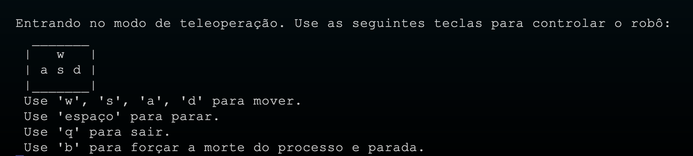

## Introdução

&emsp;&emsp; Este documento é crucial para qualquer usuário que deseje inicializar e operar eficientemente a Interface de Linha de Comando (CLI) e o sistema robótico associado. Contendo instruções detalhadas e meticulosas, ele serve como um guia fundamental para configurar corretamente ambos os componentes tecnológicos. Ao seguir este manual, espera-se que os sistemas operem com plena funcionalidade, otimizando sua performance operacional.

&emsp;&emsp; A aderência rigorosa aos procedimentos descritos é vital. Isso não apenas facilita uma configuração bem-sucedida, mas também previne possíveis falhas operacionais. A execução correta dessas etapas assegura que eventuais problemas sejam minimizados, permitindo que o usuário explore todo o potencial do sistema.

&emsp;&emsp; Portanto, é imprescindível seguir cuidadosamente cada passo apresentado neste documento. Fazer isso garantirá o melhor desempenho possível do equipamento, maximizando a eficiência e eficácia na utilização da CLI e do sistema robótico.

### Versões das Bibliotecas Necessárias

:::danger
Para **evitar** problemas de compatibilidade e garantir a integridade do ambiente de execução, é imperativo utilizar as versões das bibliotecas conforme listado abaixo
:::

- **ROS2**: `humble`
- **Python**: `3.10.10`
- **Typer**: `0.9.0`
- **Inquirer**: `3.2.4`

## Preparação do Ambiente de Execução

:::warning
Para garantir uma execução eficiente do software, é **essencial** preparar adequadamente o ambiente de execução. Isso evitará problemas e erros durante a operação do robô.
:::

### Configuração do Sistema Operacional

&emsp;&emsp; O software foi desenvolvido para ser executado especificamente no Ubuntu 22.04. Utilizar uma versão ou sistema operacional diferente pode resultar em falhas de execução.

:::tip
Para checar sua versão atual do Ubuntu, digite no terminal o seguinte:
```bash
lsb_release -a
```

E veja se seguido na parte _Description_ está Ubuntu 22.04.04 LTS, se não estiver, será necessário reinstalar o sistema operacional em sua correta versão. Se necessário, segue o link com a versão correta do [Ubuntu](https://releases.ubuntu.com/jammy/)
:::

### Verificação e Instalação das Dependências

Antes de prosseguir, é essencial verificar se as dependências principais estão corretamente instaladas em seu sistema. Utilize os comandos abaixo para confirmar as versões de Python e ROS2:

```bash
python3 --version

printenv ROS_DISTRO
```
#### Instalando Python

Se o Python não estiver presente em seu sistema, instale-o usando o comando:

```bash
sudo apt install python3
```

:::info
Sempre que utilizar o comando **sudo** em seu terminal, será necessário digitar a senha de seu usuário na máquina.
:::


#### Instalando ROS2

&emsp;&emsp; Para a comunicação entre a interface de linha de comando (CLI) e o robô, será empregado o ROS2, uma escolha tecnológica estratégica que permite a transmissão eficiente de informações através de uma rede robusta. Este sistema é projetado para facilitar a interação entre dispositivos computacionais e máquinas autônomas, proporcionando uma plataforma confiável para o envio de comandos.


:::tip
Para instalar o ROS2, caso ainda não esteja configurado, siga as instruções detalhadas disponíveis neste [link](https://docs.ros.org/en/foxy/Installation.html).
:::

### Estabelecendo a Conexão de Rede

&emsp;&emsp; É crucial que seu computador esteja conectado à mesma rede Wi-Fi que o robô para permitir a comunicação.

:::tip
Para conectar o robo na mesma rede em que você está conectado em sua máquina será necessário executar os seguintes passos:

Conectar a Raspberry Pi do robô em um monitor, teclado e mouse.

Após, entrar no Ubuntu deverá se conectar a rede desejada, após isto digite **ifconfig** no terminal para adquirir o IP.

:::

### Inicialização da CLI

&emsp;&emsp; A inicialização correta da Interface de Linha de Comando (CLI) é fundamental para o controle efetivo do robô e para a execução de comandos específicos do sistema. Para começar, siga estes passos detalhadamente para garantir que a CLI seja iniciada sem problemas:

:::danger
Antes de executar os passos aqui ditos, entre no arquivo **exec2_bash.sh** ou **exec2_zsh.sh** e altere o `SSH_HOSTNAME` para o _IP_ da Raspberry Pi adquirido após se conectar a rede desejada.
:::

#### Configuração para o Bash

1. **Clonar o Repositório do Projeto:**
Abra um terminal e digite o seguinte comando para clonar o repositório do projeto para sua máquina local:

```bash
git clone https://github.com/Inteli-College/2024-1B-T08-EC06-G04.git
```
2. **Acessar o Diretório do Projeto:**
Navegue até o diretório do projeto utilizando o comando:

```bash
cd 2024-1B-T08-EC06-G04
```

3. **Instale venv em sua máquina:**
Instale a extensão de ambiente virtual do python 3.10:

```bash
sudo apt install python3.10-venv
```

4. **Execute o script de inicialização**

Execute o seguinte código para o robô "escutar" os publishers feitos pela CLI:

:::note
Senha do SSH `grupo412`
:::

```bash
ssh grupo4@10.128.0.9
```

Após, digite a senha

```bash
ros2 launch turtlebot3_bringup robot.launch.py
```

Em uma nova aba do terminal, continue com a execução do segundo script para abrir a interface CLI em sua máquina:

```bash
./exec_bash.sh
```

#### Configuração para o Zsh

Para usuários do Zsh, os comandos são ligeiramente diferentes:

1. **Clonar o Repositório do Projeto:**
Abra um terminal e digite o seguinte comando para clonar o repositório do projeto para sua máquina local:

```bash
git clone https://github.com/Inteli-College/2024-1B-T08-EC06-G04.git
```
2. **Acessar o Diretório do Projeto:**
Navegue até o diretório do projeto utilizando o comando:

```bash
cd 2024-1B-T08-EC06-G04
```

3. **Instale venv em sua máquina:**
Instale a extensão de ambiente virtual do python 3.10:

```bash
sudo apt install python3.10-venv
```

3. **Execute o script de inicialização**
Execute o seguinte código para o robô "escutar" os publishers feitos pela CLI:

:::note
Senha do SSH `grupo412`
:::

```bash
ssh grupo4@10.128.0.9
```

Após, digite a senha

```bash
ros2 launch turtlebot3_bringup robot.launch.py
```

Em uma nova aba do terminal, continue com a execução do segundo script para abrir a interface CLI em sua máquina:

```bash
./exec_zsh.sh
```

Uma vez concluídos esses procedimentos, a Interface de Linha de Comando (CLI) estará totalmente operacional e configurada para facilitar a interação eficaz com o robô.


## Operação da CLI

Após abrir a CLI, será deparado com a seguinte interface:


Contendo as seguintes opções: **Teleoperação**, **Conectar**, **Desconectar**, **Para de Emergência**, **Sair**

:::tip
Para utilizar a CLI e escolher a opção desejada, usa-se as setas do teclado para cima e baixo afim de navegar e a tecla `Enter` para selecionar a opção desejada.
:::

Segue abaixo a funcionalidade de cada um deles;

- Teleoperação: Após aberto, permite movimentar o robô com as teclas `W,A,S,D` respectivamente para frente, girar lado esquerdo, para trás, girar lado direto. Além disso, caso aperte a tecla `"Espaço"`, o robô irá parar, a tecla `"q"` irá sair do modo de teleoperação e a tecla `"b"` irá matar o processo, afim de ser a _"parada de emergência"_ do robô



- Conectar: Para poder operar o robô na teleoperação é necessário conectar o mesmo, clicando na opção de `Conectar`

- Desconectar: Após conectar e utilizar o robô, é possível escolher a opção `desconectar` para evitar o uso sem querer do robô

- Parada de emergência: Ao escolher a opção parada de emergência, não importará se estiver conectado, desconectado ou fora da interface de teleoperação, o robô irá parar o que ele está executando. Após será aberta uma nova interface de escolhas, onde será possível sair da CLI ou, iniciar o processo novamente, voltando a interface anterior. Segue abaixo está outra interface que é aberta ao escolher `Parada de Emergência`:


- Sair: Por fim, há também a opção Sair, onde se for clicada, apenas encerrará o processo da CLI

:::note
Se der algum problema relacionado a CLI e ela não fechar, digite a combinação de teclas **CTRL + C** repetidas vezes até finalizar completamente o processo
:::
