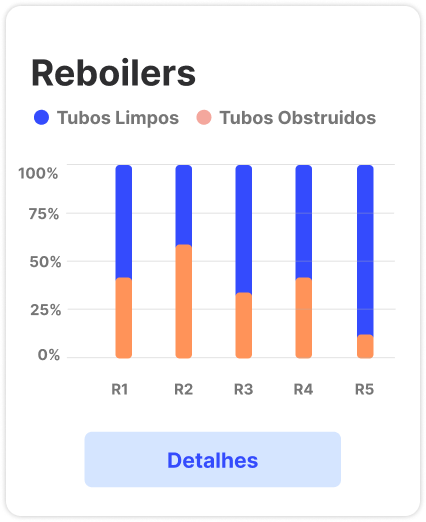
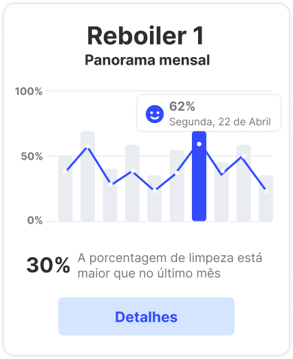
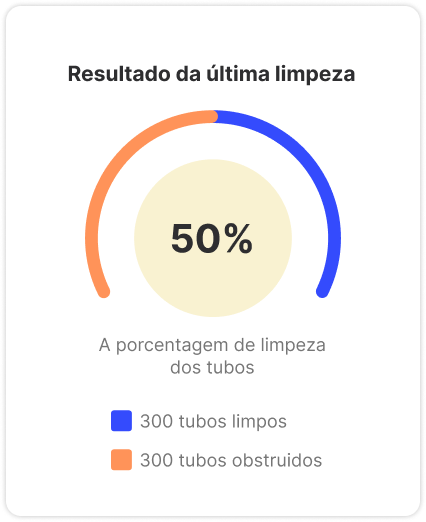

# Documentação da API e Sugestões de Gráficos

## Descrição dos Dados Disponíveis na API

### 1. Informações Gerais
A API fornece acesso aos seguintes dados:
- **Tubos limpos e sujos**: Quais tubos estão limpos e quais estão sujos e precisam de uma segunda limpeza, de acordo com a Inteligência Artificial aplicada na câmera do robô. Destaca-se que, estará também qual a localidade dos tubos que por ventura ainda estão sujops.
- **Data da última limpeza**: Registro de qual a última data da limpeza, e se necessitou de uma limpeza dupla ou não

### 2. Endpoints Disponíveis
- **GET /all_reboilers**: Retorna uma lista com os resultados da limpeza de todos os reboilers.
<details> 
<summary mdxType="summary">Resposta</summary>

```json
      [
    {
      "reboiler_id": "string",
      "clean_status": [
        {
          "tube_id": "string",
          "status": "clean" | "dirty",
          "location": "string"
        }
      ],
      "last_clean_date": "YYYY-MM-DD",
      "double_clean_needed": "true" | "false"
    }
  ]
  ```

</details>

- **GET /reboilerX/monthly**: Retorna uma lista com os resultados das limpezas do último mês para um reboiler específico.
  - Parâmetros: `reboiler_id` - ID do reboiler específico (substituir X pelo ID do reboiler).
<details> 
<summary mdxType="summary">Resposta</summary>

```json
     {
  "reboiler_id": "string",
  "monthly_cleanings": [
    {
      "date": "YYYY-MM-DD",
      "clean_status": [
        {
          "tube_id": "string",
          "status": "clean" | "dirty",
          "location": "string"
        }
      ],
      "double_clean_needed": "true" | "false"
      }
    ]
  }
  ```

</details>
  
- **GET /reboilerX/last_clean**: Retorna os detalhes da última limpeza de um reboiler específico.
  - Parâmetros: `reboiler_id` ID do reboiler específico (substituir X pelo ID do reboiler).
<details> 
<summary mdxType="summary">Resposta</summary>

```json
     {
  "reboiler_id": "string",
  "last_clean_date": "YYYY-MM-DD",
  "clean_status": [
    {
      "tube_id": "string",
      "status": "clean" | "dirty",
      "location": "string"
    }
  ],
  "double_clean_needed": "true" | "false"
  }
  ```

</details>
  
- **POST /reboilerX/add_cleaning**: Adiciona um registro de limpeza para um reboiler específico.
  - Parâmetros: `reboiler_id` - ID do reboiler específico (substituir X pelo ID do reboiler).
<details> 
<summary mdxType="summary">Corpo da requisição</summary>

```json
    {
  "date": "YYYY-MM-DD",
  "clean_status": [
    {
      "tube_id": "string",
      "status": "clean" | "dirty",
      "location": "string"
    }
  ],
  "double_clean_needed": "true" | "false"
  }
  ```

</details>
  
<details> 
<summary mdxType="summary">Resposta</summary>

```json
   {
  "message": "Cleaning record added successfully",
  "reboiler_id": "string",
  "date": "YYYY-MM-DD"
  }
  ```

</details>

:::info
Os formatos de resposta apresentados são apenas sugestões primárias e podem ser ajustados conforme necessário nas próximas sprints.
:::

## Sugestões de Gráficos para a Plataforma de BI

### 1. Gráfico de Visualização de Todos os Reboilers
**Descrição**: Um gráfico de barras que mostra a porcentagem de tubos limpos e obstruídos na última limpeza de todos os reboilers registrados.  
**Utilidade**: Este gráfico é uma ferramenta essencial para gerentes de manutenção e operadores, pois permite uma visualização rápida e intuitiva da eficiência das operações de limpeza dos reboilers. Através dele, é possível identificar quais reboilers estão sendo limpos de forma eficaz e quais necessitam de melhorias no processo de limpeza. Isso pode ser crucial para planejar intervenções de manutenção, alocar recursos de forma mais eficiente e garantir que os reboilers operem de maneira otimizada, minimizando o risco de falhas e aumentando a vida útil do equipamento. Além disso, o gráfico facilita a comparação entre diferentes reboilers, destacando aqueles que consistentemente apresentam altos níveis de obstrução após a limpeza. Essas informações são valiosas para identificar padrões e possíveis causas subjacentes de problemas de obstrução, permitindo a implementação de soluções mais eficazes e direcionadas. 
**Exemplo**:



### 2. Gráfico de Visualização Mensal
**Descrição**: Este gráfico de barras e linhas apresenta a porcentagem de tubos limpos e obstruídos nas limpezas realizadas durante o último mês para todos os reboilers registrados no sistema. Cada barra representa um reboiler específico, dividida em duas seções distintas: a parte superior da barra, geralmente colorida de azul, indica a proporção de tubos que foram efetivamente limpos;
**Utilidade**:  Este gráfico é uma ferramenta para monitorar e analisar mudanças graduais no processo de limpeza ao longo do tempo, que podem não ser evidentes na análise de limpezas individuais. Ao observar a evolução mensal, gerentes e operadores podem identificar tendências e padrões que apontem para uma melhoria ou deterioração da eficácia da limpeza. Por exemplo, se um reboiler mostra um aumento gradual na porcentagem de tubos obstruídos mês após mês, isso pode indicar um problema crescente que precisa ser abordado antes que se torne crítico. Da mesma forma, uma melhoria contínua na proporção de tubos limpos pode sugerir que as novas técnicas ou procedimentos de limpeza implementados estão funcionando eficazmente.
**Exemplo**:



### 3. Gráfico da Última Limpeza
**Descrição**: Este gráfico de pizza fornece uma representação visual da quantidade de tubos limpos e obstruídos na última limpeza de um reboiler específico. O gráfico é dividido em duas seções distintas: a porção verde do gráfico representa os tubos que foram limpos com sucesso, enquanto a porção vermelha indica os tubos que permaneceram obstruídos após a limpeza. Este gráfico é atualizado cada vez que uma nova limpeza é realizada, refletindo os resultados mais recentes.
**Utilidade**: Com este gráfico, é evidente que a maioria dos tubos foi limpa com sucesso, mas há uma quantidade significativa que permaneceu obstruída. Esta informação pode levar a uma revisão do processo de limpeza para identificar e corrigir as causas das obstruções persistentes. Este tipo de visualização é especialmente útil em reuniões de equipe ou apresentações, onde os dados precisam ser apresentados de forma concisa e impactante, facilitando a discussão e a tomada de decisão baseada em evidências claras e visualmente acessíveis. 
**Exemplo**:



## Considerações Finais
&emsp;&emsp;Esta documentação foi elaborada com o objetivo de fornecer uma visão clara, detalhada e abrangente dos dados disponíveis através da API, bem como apresentar sugestões de gráficos para facilitar a análise e visualização desses dados na plataforma de Business Intelligence (BI) do cliente. Ao longo deste documento, abordamos diversos aspectos essenciais para garantir uma utilização eficiente e eficaz da API e dos gráficos propostos.

&emsp;&emsp;Primeiramente, fornecemos uma descrição geral dos dados acessíveis via API, destacando informações cruciais sobre a condição dos tubos, como quais estão limpos e quais estão sujos e necessitam de uma segunda limpeza, conforme a análise realizada pela Inteligência Artificial (IA) integrada à câmera do robô. Além disso, mencionamos a importância do registro da data da última limpeza, especificando se foi necessária uma limpeza dupla ou não. Esta informação é vital para manter um histórico detalhado das operações de manutenção, permitindo uma análise precisa do desempenho ao longo do tempo.
