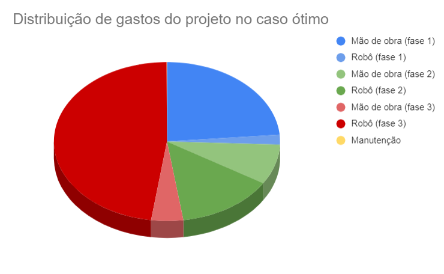
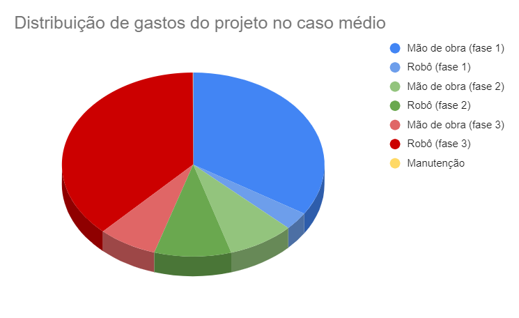
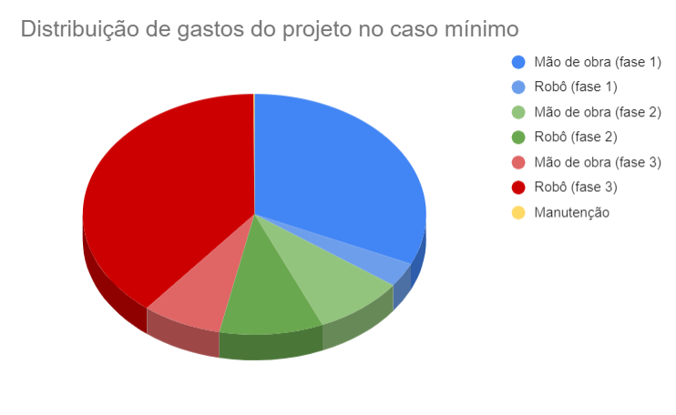

# Análise Financeira do Projeto Final

O produto final que imaginamos caso nosso grupo estivesse responsável por desenvolver uma solução finalizada para a Atvos consiste em uma frota de robôs AGV com controles remotos responsáveis por verificar a situação dos canos no começo do processo de limpeza. A ideia consiste em introduzir 32 robôs desenvolvidos no projeto em cada reboiler da planta e realizar a verificação dos canos do reboiler utilizando uma câmera e um modelo de visão computacional para interpretar a imagem e informar ao sistema central as informações recolhidas, acelerando o processo de limpeza.

:::danger
Esta análise financeira foi realizada em `23/05/2024`. É importante ressaltar que, após essa data, os preços e os impostos aplicáveis podem ter sofrido alterações significativas. As condições de mercado estão em constante mudança, e fatores como variações cambiais, mudanças na legislação fiscal, e flutuações na oferta e demanda podem impactar os custos e impostos associados. 
:::

## Introdução

Antes de tratar da precificação, como o projeto envolve tecnologias proprietárias as quais serão desenvolvidas durante o processo, a implementação do projeto deve ser gradual e pode ser analisada como:

- **Primeira fase** (2 anos):
    - Fase de pesquisa e prototipação inicial do robô. Esta fase tem como objetivo definir e satisfazer critérios de teste tanto na construção do software e hardware do robô (exemplos: latência máxima no movimento, atraso na imagem da câmera) quanto na coleta de dados e treinamento do modelo de inteligência artificial (exemplo: minimizar falsos positivos e falsos negativos), desta maneira, assegurando que o robô criado funciona corretamente no ambiente para o qual foi desenvolvido (deve ser resistente a umidade e calor), verificando os casos de quebra e prototipando novamente e calibrando conforme os resultados dos testes.

- **Segunda fase** (6 meses):
    - Fase de aumento de escala e implementação do sistema geral de controle que conecta o cliente com os robôs. Esta fase visa adicionar mais robôs e desenvolver o sistema de controle central para os robôs, criando uma rede conectada e de fácil acesso ao controlador além de aumentar a rigidez dos critérios de avaliação e testar no ambiente real o modelo de visão computacional

- **Terceira fase** (6 meses):
    - Fase de implementação final, ou seja, aumento final da escala, calibragens finais nos sistemas envolvidos e concretização final dos requisitos funcionais e não funcionais do projeto.

## Precificações

Para criar uma análise financeira deste projeto, precisamos imaginar possíveis custos no desenvolvimento e diferentes faixas de preço de acordo com a capacidade de investimento do cliente, assim, a precificação será dividida em três: ótima, média e mínima. Possuindo esta separação e as fases apresentadas anteriormente, a análise financeira consiste em:

### 1) Preço ótimo

#### Fase 1

    - Para o desenvolvimento, estima-se a necessidade durante toda a fase de um engenheiro mecânico, dois engenheiros da computação, um engenheiro elétrico, um engenheiro mecatrônico e um designer de arquitetura tanto de sistemas quanto da informação, além de contratar um cientistas da computação e um desenvolvedor de inteligência artificial nos últimos três meses desta fase. Preço: `(7000 + 2 * 5000 + 4000 + 5000 + 2500) * 24 + (3000 + 7000) * 3 = R$714.000,00`.
    - Por não existir um robô comercial que satisfaz todos os requisitos funcionais do projeto, será necessária a construção de um novo modelo, para tal, estimamos a utilização de dois ou três microcontroladores, uma câmera comum, um LiDAR, conexão com o wi-fi, modo guiado e resistência a calor e umidade. Levando em consideração os requisitos apresentados e o preço de robôs comerciais de tamanho e peso similares ao modelo esperado pelo projeto, estima-se que o preço para a construção de um robô seja aproximadamente `R$60.000,00`.

#### Fase 2

    - Na fase dois, espera-se adicionar 7 novos robôs no projeto para testes mais extensos dos critérios trabalhados e implementação do sistema único de controle dos robôs. Preço: `60.000 * 7 = R$420.000,00`
    - Em relação aos colaboradores, estimamos que será necessário três engenheiros da computação, um engenheiro elétrico, dois engenheiros mecânicos, um engenheiro mecatrônico e um cientista da computação, totalizando um preço de `(3 * 5000 + 4000 + 2 * 7000 + 5000 + 3000) * 6 = R$246.000,00`

#### Fase 3

    - Nesta fase, espera-se adicionar 24 novos robôs para totalizarmos um robô por reboiler da planta, assim, o preço é `24 * 60.000 = R$1.440.000,00`
    - Como a fase consiste em correções finais e concretização de requisitos,  será necessário dois engenheiros da computação, um engenheiro mecânico e um engenheiro de software para fazerem as verificações e instalações finais dos robôs, sistema de controle e comunicação. Para tal, o preço esperado é de `(2 * 5000 + 7000 + 6000) * 6 = R$138.000,00`

#### Manutenção

    - Para o preço ótimo, adicionaremos um ano de manutenção inclusa no contrato inicial, para isso, esperamos que 4 técnicos em mecânica façam a manutenção dos robôs a cada 3 meses. Aproximando-se que é necessário uma hora e meia para verificar cada robô e um técnico em mecânica ganha R$10,00 por hora de trabalho, temos um preço de `4 * 8 * 1.5 * 10 * 4 = R$1.920,00`

#### Preço final

Assumindo um lucro de 15% e o imposto como 10% do valor final: `(714.000 + 60.000 + 420.000 + 246.000 + 1.440.000 + 138.000 + 1.920) * 1.15 * 1.10` = ***R$ 3.820.198,80***

### 2) Preço médio

#### Fase 1

    - Em relação ao desenvolvimento no caso médio, diminuímos o número de contratantes, estimando-se a necessidade durante toda a fase de um engenheiro mecânico, um engenheiro da computação, um engenheiro elétrico, um engenheiro mecatrônico e um designer de arquitetura tanto de sistemas quanto de informação, além de contratar um desenvolvedor de inteligência artificial nos últimos três meses desta fase. Preço: `(7000 + 5000 + 4000 + 5000 + 2500) * 24 + (7000) * 3 = R$585.000,00.`
    - O desenvolvimento e materiais continuam iguais ao caso ótimo, assim, o valor de produção de cada robô continua R$60.000,00.

#### Fase 2

    - Na fase dois, espera-se adicionar 3 novos robôs no projeto para testes mais extensos dos critérios trabalhados e implementação do sistema único de controle dos robôs. Preço: `60.000 * 3 = R$180.000,00`
    - Em relação aos colaboradores, estimamos que será necessário dois engenheiros da computação, um engenheiro elétrico, um engenheiros mecânicos e um engenheiro mecatrônico, totalizando um preço de `(2 * 5000 + 4000 +  7000 + 5000) * 6 = R$156.000,00`

#### Fase 3

    - Nesta fase, espera-se adicionar 12 novos robôs para metade dos reboilers possuírem um robô, assim, o preço é `12 * 60.000 = R$720.000,00`
    - Como a fase consiste em correções finais e concretização de requisitos,  será necessário dois engenheiros da computação, um engenheiro mecânico e um engenheiro de software para fazerem as verificações e instalações finais dos robôs, sistema de controle e comunicação. Para tal, o preço esperado é de `(2 * 5000 + 7000 + 6000) * 6 = R$138.000,00`

#### Manutenção

    - Para o preço médio, adicionaremos um ano de manutenção inclusa no contrato inicial, para isso, esperamos que 2 técnicos em mecânica façam a manutenção dos robôs a cada 3 meses. Aproximando-se que é necessário uma hora e meia para verificar cada robô e um técnico em mecânica ganha R$10,00 por hora de trabalho, temos um preço de `2 * 8 * 1.5 * 10 * 4 = R$960,00`

#### Preço final

Assumindo um lucro de 15% e o imposto como 10% do valor final:` (585.000 + 60.000 + 180.000 + 156.000 + 720.000 + 138.000 + 960) * 1.15 * 1.10` = ***R$2.327.549,40***

### 3) Preço mínimo

#### Fase 1

    - Em relação ao caso médio, retirou-se o designer do projeto, estimando-se a necessidade durante toda a fase de um engenheiro mecânico, um engenheiro da computação, um engenheiro elétrico, um engenheiro mecatrônico, além de contratar um desenvolvedor de inteligência artificial nos últimos três meses desta fase. Preço: `(7000 + 5000 + 4000 + 5000) * 24 + (7000) * 3 = R$525.000,00`.
    - O desenvolvimento e materiais continuam iguais ao caso ótimo, assim, o valor de produção de cada robô continua R$60.000,00.

#### Fase 2

    - Na fase dois, espera-se adicionar 3 novos robôs no projeto para testes mais extensos dos critérios trabalhados e implementação do sistema único de controle dos robôs. Preço: `60.000 * 3 = R$180.000,00`
    - Em relação aos colaboradores, estimamos que será necessário dois engenheiros da computação, um engenheiro elétrico, um engenheiros mecânicos e um engenheiro mecatrônico, totalizando um preço de `(2 * 5000 + 4000 +  7000 + 5000) * 6 = R$156.000,00`

#### Fase 3

    - Nesta fase, espera-se adicionar 4 novos robôs para totalizarmos um robô para cada quatro reboilers da planta, assim, o preço é `4 * 60.000 = R$240.000,00`
    - Como a fase consiste em correções finais e concretização de requisitos,  será necessário dois engenheiros da computação, um engenheiro mecânico e um engenheiro de software para fazerem as verificações e instalações finais dos robôs, sistema de controle e comunicação. Para tal, o preço esperado é de `(2 * 5000 + 7000 + 6000) * 6 = R$138.000,00`

#### Manutenção

    - Para o preço mínimo, não colocaremos a manutenção do primeiro ano, sendo que ela estaria “inclusa” no preço do projeto (subtrair diretamente do lucro)

#### Preço final

Assumindo um lucro de 10% e o imposto como 10% do valor final: `(525.000 + 60.000 + 180.000 + 156.000 + 240.000 + 138.000) * 1.10 * 1.10` = ***R$1.571.790,00***

> Para acessar a planilha com as tabelas e gráficos dos casos clique [aqui](https://docs.google.com/spreadsheets/d/12WHbTswyZQukp0swzPR6es5EENKOw2JQxbvCMslcvEg/edit?usp=sharing)

