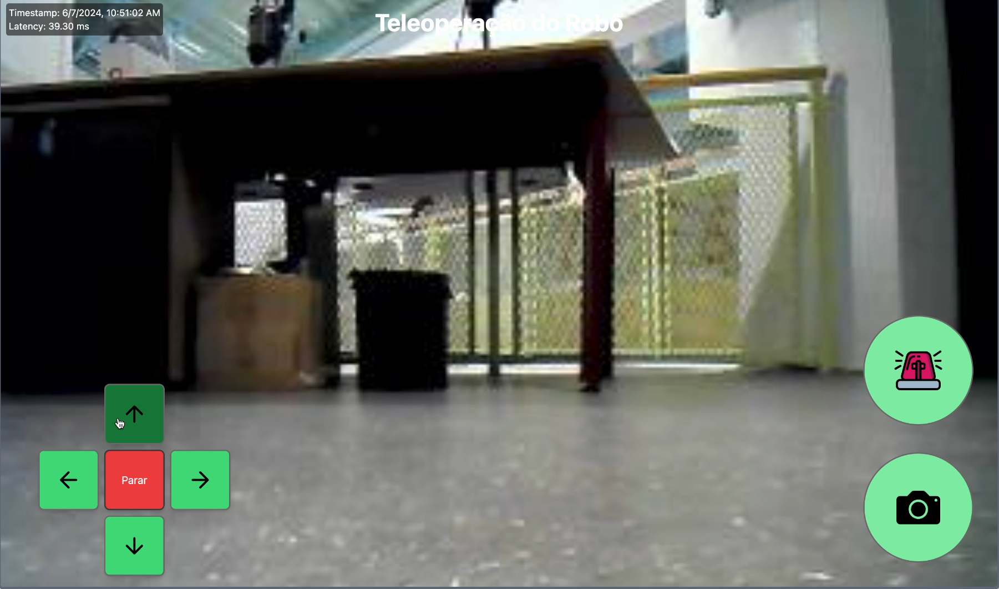

# Introdução

&emsp;&emsp;Este documento é crucial para qualquer usuário que deseje inicializar e operar eficientemente o projeto desenvolvido até esta Sprint. Contendo instruções detalhadas e meticulosas, ele serve como um guia fundamental para configurar corretamente todos os componentes do sistema. Ao seguir este manual, espera-se que o projeto opere com plena funcionalidade, otimizando sua performance operacional.

&emsp;&emsp;A aderência rigorosa aos procedimentos descritos é vital. Isso não apenas facilita uma configuração bem-sucedida, mas também previne possíveis falhas operacionais. A execução correta dessas etapas assegura que eventuais problemas sejam minimizados, permitindo que o usuário explore todo o potencial do projeto.

&emsp;&emsp;Portanto, é imprescindível seguir cuidadosamente cada passo apresentado neste documento. Fazer isso garantirá o melhor desempenho possível do projeto, maximizando a eficiência e eficácia na sua utilização.

## **1.0.0 Versões das bibliotecas necessárias:**

:::danger
Caso julgue necessário, pode utilizar uma biblioteca em versão mais recente ou mais antiga. Todavia faça o mesmo em seu próprio **risco** pois pode acarretar em problemas na execução do código.
:::

### 1.1 Bibliotecas utilizadas

Segue abaixo tanto as bibliotecas utilizadas quanto as versões utilizadas das mesmas:

- **Yolo**: V8
- **FastAPI**: 0.111.0
- **Tiny DB**: 4.8.0
- **Uvicorn**: 0.30.1
- **Websockets**: 12.0
- **Ultralytics**: 8.2.28

## **2.0.0 Setup do ambiente**

:::info
Para poder executar o código, **não é necessário** ter `Ubuntu 22.04` e `ROS2` em sua máquina, porém ter os mesmos irá **reduzir** a latência tanto da câmera quanto dos controles relacionados ao robô.
:::

&emsp;&emsp; É importantíssimo ter tanto o `python` quanto o `npm` instalados em sua máquina, mais abaixo será explicado corretamente como checar se ambos estão instalados. Também será explicado como checar a versão do Ubuntu e ROS, se os mesmos forem utilizados pela sua preferência.

### 2.1. Configuração do Sistema Operacional (Opcional)

&emsp;&emsp; O software foi desenvolvido para ser executado no Ubuntu 22.04 preferencialmente. Utilizar uma versão ou sistema operacional diferente pode resultar em uma execução mais lenta.

:::tip
Para checar sua versão atual do Ubuntu, digite no terminal o seguinte:
```bash
lsb_release -a
```

E veja se seguido na parte _Description_ está Ubuntu 22.04.04 LTS, se não estiver, será necessário reinstalar o sistema operacional em sua correta versão. Se necessário, segue o link com a versão correta do [Ubuntu](https://releases.ubuntu.com/jammy/)
:::

!!Lembrando, **não** é necessário ter o `Ubuntu` e nem o `ROS`!!

### 2.2. Instalação do ROS (Opcional)

Antes de prosseguir, verifique se o ROS2 está instalado em seu sistema. Utilize o comando abaixo para confirmar a instalação do mesmo.

```bash
printenv ROS_DISTRO
```

Se ele já estiver instalado, pode pular para a próxima etapa, caso ele não estiver instalado, siga o tutorial abaixo.

### 2.2. Instalando ROS (Opcional)

Afim de instalar o ROS2 em seu S.O, primeiro certifique-se de estar no Ubuntu 22.04, caso contrário não funcionará.

&emsp;&emsp; Para a comunicação entre a interface de linha de comando (CLI) e o robô, será empregado o ROS2, uma escolha tecnológica estratégica que permite a transmissão eficiente de informações através de uma rede robusta. Este sistema é projetado para facilitar a interação entre dispositivos computacionais e máquinas autônomas, proporcionando uma plataforma confiável para o envio de comandos.

Dada a extensão da instalação e configuração do ROS2, é mais fácil seguir a documentação principal do mesmo afim de evitar erros.

:::tip
Para instalar o ROS2, caso ainda não esteja configurado, siga as instruções detalhadas disponíveis neste [link](https://docs.ros.org/en/foxy/Installation.html).
:::

### 2.3. Instalação do Python

Antes de prosseguir, é essencial verificar se o python está instalado em seu sistema. Utilize os comandos abaixo para verificar a instalação do python

```bash
python3 --version
```

Se o mesmo retornar algum erro, será necessário seguir o tutorial abaixo para instalar o python, caso contrário, pule a próxima etapa.

### 2.3.1 Instalando Python

Execute o seguinte comando para instalar o Python no Ubuntu 22.04 ou MacOs

Ubuntu 22.04

```bash
sudo apt install python3
```

:::warning
O comando `sudo` sempre irá pedir a senha de sua máquina, para instalar aplicativos no Ubuntu, é necessário permissão de `root` ou seja, permissão total no sistema. Logo deve-se adicionar o sudo antes do comando.
:::

MacOs

```bash
brew install python
```

Windows

Acesse o seguinte [link](https://www.python.org/downloads/windows/) e siga os tutoriais nele para baixar o `.exe` referente ao python.

Após isto digite no terminal o seguinte para checar se o python está instalado

```bash
python3 --version
```

Se retornar python não encontrado, siga os passos de instalação novamente e reinicie seu sistema. Se retornar a versão de python pode prosseguir. Se seguir sem retornar, tente checar a documentação oficial do python em seu sistema operacional afim de procurar por erros.

## **3.0.0 Conexão rede - Mesma rede que robô**

### 3.1 Como conectar o robô na rede

Afim de adquirir a conexão entre o robô e a máquina local para passar informações, é essencial que tanto o robô quanto a máquina que rodará o código da interface estejam na mesma rede Wi-Fi, podendo ser tanto uma rede local, quanto um hotspot.

:::warning
Certifique-se de que a rede não possua `travas` ou qualquer coisa do tipo que trave a comunicação entre o robô e a maquina local, lembrando que o protocolo de comunicação utilizado é o **ROS**
:::

Afim de conectar o robô em alguma rede, é necessário conectar um monitor teclado e mouse a Raspberry Pi do robô, e após isto conectar o mesmo a rede desejada, através do simbolo de rede localizado no canto superior direito.

:::tip
Para checar o ip de seu robô na rede deve-se digitar **ifconfig** no terminal do robô, podendo assim adquirir o IP do mesmo, futuramente será necessário.
:::

## **4.0.0 Inicialização do bringup no robô**

A inicialização correta do bringup no robô é crucial para garantir que todos os sistemas estejam funcionando de maneira harmoniosa. No contexto do ROS2 e TurtleBot, o bringup refere-se ao processo de iniciar e configurar todos os nós, tópicos e serviços necessários para operar o robô. Seguir as etapas abaixo ajudará a garantir uma inicialização bem-sucedida:

:::info
Neste caso, foi desenolvido um novo bringup, afim de que ao pressionar o botão de emergência ele **encerra** o processo do bringup dentro do robô, fazendo com que seja impossível do mesmo continuar se movendo
:::

### 4.1.0 Fontar o workspace

Primeiramente, deve-se fontar o workspace do ROS2 em que o bringup está presente, para fazer o mesmo siga o tutorial abaixo a risca.

:::info
Fontar o ambiente no ROS significa executar o script `setup.bash` para configurar as variáveis de ambiente necessárias, permitindo que os comandos e pacotes do ROS funcionem corretamente.
:::

Primeiro entre no diretório do workspace
```bash
cd ~/main_ws
```

Após entrar no workspace deve-se fontar o mesmo.

```bash
source install/local_setup.bash
```

Se a parte de fontar der algum erro, execute o seguinte e logo em seguida, tente fontar novamente:

```bash
colcon build
```

### 4.2.0 Inicialização do arquivo de launch do ROS2

Após fontar o workspace, deve-se inicializar de fato o bringup, para fazer o seguinte digite os seguinte comandos.

Primeiro, entre no diretório launch
```bash
cd ~/main_ws/launch
```

Após entrar no diretório de launch, execute os arquivos de launch
```bash
ros2 launch launch.py
```

Após todos estes passos deve estar executando normalmente o bringup.

:::tip
Para checagem se o bringup de fato deu certo, cheque se o mesmo mostra no console que está enviando as imagens em formato **base64**.
::: 

## **5.0.0 Inicialização do Websocket**

Afim de compartilhar as informações entre o robô e o react foi utilizado o Rosbridge, que cria um websocket entre o robô e a interface visual.

Há também dois métodos de inicializar no Websocket, se o usuário tem o ROS2 e Ubuntu, deverá inicializar o mesmo em sua máquina local, seguindo o tutorial de numeração **5.1.1**.

Caso contrário, siga o tutorial de numeração **5.1.0** onde o Websocket é aberto dentro do robô.

### 5.1.0 Inicialização Websocket no robô

Afim de iniciar o Websocket dentro do robô, deve-se seguir os passos abaixo. Além disso, se certifique-se de estar em um terminal ou `.bash` ou `.zsh`.

Primeiramente conecte-se via `SSH` com o robô, para isso execute o seguinte código

```bash
ssh grupo4@10.128.0.9
```

:::info
Se pedir senha digite `grupo412`
:::

Após isto, rode no terminal do mesmo o seguinte comando para abrir o Websocket

```bash
ros2 launch rosbridge_server rosbridge_websocket_launch.xml
```

E aguarde até o mesmo abrir na porta padrão: `9090`, após isto pode seguir com as instruções.

### 5.1.1 Inicialização Websocket na máquina local

Se o Ubuntu 22.04 e o ROS2 estão instalados em sua máquina, apenas digite o seguinte comando em seu terminal

```bash
ros2 launch rosbridge_server rosbridge_websocket_launch.xml
```

Após isto, seu Websocket estará aberto na porta padrão.

## **6.0.0 Inicialização da interface**

A inicialização correta da interface gráfica é fundamental para o controle efetivo do robô e para a execução de comandos específicos do sistema. Para começar, siga estes passos detalhadamente para garantir que a interface gráfica seja iniciada sem problemas

### 6.1.0 Clonagem do repositório do GitHub na máquina local

Primeiramente, deve-se clonar este repositório em sua máquina local, afim de realizar o mesmo, digite o seguinte comando em seu terminal.

```bash
git clone https://github.com/Inteli-College/2024-1B-T08-EC06-G04.git
```


### 6.2.0 Inicialização do backend

Afim de inicializar o backend, é necessário primeiramente ter todas as bibliotecas instaladas em sua máquina. Para fazer o mesmo, siga os passos abaixo. 

:::danger
Se as bibliotecas não estiverem instaladas, o backend **não** poderá ser aberto e resultará em algum erro
:::

Primeiramente instale o uvicorn com o seguinte comando

```bash
pip install uvicorn
```

Após isto, instale o resto das bibliotecas com o seguinte comando

```bash
pip install fastapi ultralytics opencv-python tinydb
```

Após isto, navegue até o diretório `SRC` do backend, com o seguinte comando

:::info
Certifique-se de já estar no diretório deste projeto
:::

```bash
cd src/backend/src
```

Após entrar no diretório principal do backend, execute o seguinte código para iniciar a FastAPI

```bash
uvicorn app:app --reload
```

Após isto, seu backend estará ligado e funcional. Vale lembrar que o mesmo irá armazenar todas as `fotos` tiradas pelo robô.

### 6.3.0 Inicialização da aplicação

Afim de inicializar o website com a interface do robô, será necessário inicializar o React criado. Para fazer tal feito, deve-se digitar os seguintes códigos em seu terminal

Primeiramente vá ao diretório correto para inicialização

```bash
cd src/react/ProjetoMod6
```

Após ir até o diretório correto, execute o seguinte comando para instalar todas as depêndencias.

```bash
npm i
```

Após isto, inicie a interface web com o seguinte comando

```bash
npm run dev
```

Após todos estes passos, a interface está pronta para ser utilizada, caso algum problema tenha ocorrido, repasse sobre todas as etapas novamente.

:::warning
As instruções de operação seguem abaixo, para operar o robô do modo correto, **siga** os mesmos.
:::

## **7.0.0 Operações de Uso**

Para operar o robô corretamente, siga rigorosamente as instruções abaixo. Qualquer desvio das instruções pode resultar em problemas de uso, e dependendo da situação, pode causar problemas futuros com o robô.

### 7.1. Vídeo Tutorial

Para facilitar a compreensão e operação do robô, recomendamos assistir ao vídeo tutorial que demonstra todos os passos necessários para utilizá-lo corretamente. O vídeo inclui instruções detalhadas sobre cada funcionalidade e procedimento de segurança a ser seguido.

:::info
Assista ao vídeo clicando [**aqui**](https://www.youtube.com/watch?v=nqLnoy5JzoM)
:::

### 7.2. Movimentação do Robô

O robô possui as seguintes capacidades de movimentação:
- **Mover para frente:** Utilize o comando específico para mover o robô para frente. Este comando é essencial para deslocamentos lineares e deve ser usado com cuidado para evitar colisões.
- **Mover para trás:** Utilize o comando específico para mover o robô para trás. Certifique-se de que a área atrás do robô está livre de obstáculos antes de ativar este comando.
- **Girar em seu próprio eixo:** Utilize os comandos apropriados para fazer o robô girar no sentido horário ou anti-horário. Essa funcionalidade é útil para ajustar a posição do robô sem a necessidade de grandes deslocamentos.

### 7.3. Captura de Imagens

O robô é equipado com uma câmera que permite a captura de imagens para processamento por inteligência artificial. As imagens capturadas são utilizadas para análise e tomadas de decisão, auxiliando na navegação autônoma e na detecção de objetos e obstáculos. Certifique-se de que a lente da câmera está limpa e desobstruída para garantir a qualidade das imagens.

### 7.4. Botão de Parada de Emergência

Em caso de emergência, o robô possui um botão de parada de emergência. Ao pressionar esse botão, todas as operações do robô serão imediatamente interrompidas para garantir a segurança. Este botão deve ser utilizado somente em situações de emergência para evitar danos ao robô e ao ambiente ao seu redor.

### 7.5. Notificações de Status

O robô fornece notificações visuais no canto superior direito da interface para informar o status operacional:
- **Desconectado:** Um popup será exibido no canto superior direito informando se o robô está desconectado. Certifique-se de verificar a conexão e restabelecê-la conforme necessário.
- **Movimento Travado:** Se o robô não puder se mover para frente ou para trás devido à proximidade com um objeto, um popup será exibido informando a situação. Isso é crucial para evitar danos ao robô e garantir a segurança operacional.

### 7.6. Procedimentos de Manutenção

Para garantir a longevidade e o desempenho ótimo do robô, siga os procedimentos de manutenção regularmente:
- **Verificação de Bateria:** Certifique-se de que a bateria do robô está carregada antes de iniciar qualquer operação. Evite operar o robô com níveis baixos de bateria.
- **Limpeza do Robô:** Limpe regularmente a superfície externa e as partes móveis do robô para evitar acúmulo de poeira e detritos.

Seguir essas instruções garantirá um uso seguro e eficiente do robô, prevenindo problemas operacionais e garantindo a integridade do sistema.

### 7.7 Cuidados com a bateria

Vale ressaltar que por ser uma bateria com uma arquitetura um tanto quanto complexa, é essencial o cuidado com a mesma. Utilizado no turtlebot é uma bateria de lítio de 11.1V, caso a mesma fique abaixo de 10.0V, a mesma será perdida e terá que adquirir uma subsituta.

Logo afim de prevenir o descarregamento da mesma, o robô começa a apitar quando ela está próxima de 11.0V, é essencial remover a mesma e colocá-la para carregar quando isto acontecer.

:::danger
Cuidado ao deixar a mesma carregando por períodos extensos de tempo.
:::

## **8.0.0 Como Utilizar**

Após ter assistido ao vídeo da operação do robô, siga as instruções abaixo para utilizá-lo de forma eficaz e segura.

### 8.1. Interface de Usuário

A interface do usuário foi projetada para ser intuitiva e fácil de usar. Abaixo está uma imagem mostrando como a interface está disposta:



### 8.2. Controle de Movimentação

A interface de usuário possui controles claros para a movimentação do robô dispostos na parte esquerda inferior:

:::info
Obs: Os controles em verde na parte esquerda inferior são as `setas`, enquanto o botão vermelho é o botão para `parar` de andar caso algum dos controles de movimentação trave a mesma.
:::

- **Seta para cima:** Clique neste botão para mover o robô para frente.
- **Seta para baixo:** Clique neste botão para mover o robô para trás.
- **Seta para a esquerda:** Clique neste botão para fazer o robô girar no sentido anti-horário. Este comando é útil para ajustar a direção do robô sem movê-lo para frente ou para trás.
- **Seta para a direita:** Clique neste botão para fazer o robô girar no sentido horário. Use este comando para fazer ajustes finos na direção do robô.
- **Botão "Parar":** Clique neste botão para interromper qualquer movimento que o robô esteja executando. Este botão é essencial para parar o robô rapidamente em caso de necessidade.

### 8.3. Captura de Imagens

- **Botão de câmera:** O robô está equipado com uma câmera que permite capturar imagens para processamento pela inteligência artificial. Clique no ícone da câmera para tirar uma foto. As imagens capturadas serão utilizadas para análise e tomadas de decisão, como detecção de objetos e navegação autônoma. Certifique-se de que a lente da câmera está limpa para garantir a melhor qualidade de imagem possível.

É possível localizar o mesmo, sendo o botão verde localizado no canto direito inferior com um símbolo de câmera.

### 8.4. Parada de Emergência

- **Botão de parada de emergência:** Em situações de emergência, clique neste botão para interromper todas as operações do robô imediatamente. Este botão é crucial para garantir a segurança do ambiente e do próprio robô. Use este comando somente em situações que exijam uma parada imediata para prevenir acidentes ou danos.

É possível localizar o mesmo, logo acima do botão da câmera, também verde. Ele possui um ícone de luz emergencial.

### 8.5. Notificações de Status

A interface do usuário também exibe notificações importantes para informar o status operacional do robô:

- **Desconectado:** Se o robô perder a conexão com o sistema de controle, um popup será exibido no canto superior direito da tela informando sobre a desconexão. Verifique a conexão e tome as medidas necessárias para restabelecê-la. A operação segura do robô depende de uma conexão estável.
- **Movimento Travado:** Se o robô não puder se mover para frente ou para trás devido à proximidade com um objeto, um popup será exibido informando sobre o bloqueio do movimento. Esta notificação ajuda a evitar colisões e danos ao robô. Verifique a área ao redor do robô e remova quaisquer obstáculos antes de tentar mover o robô novamente.

Seguindo essas instruções detalhadas, você poderá utilizar o robô de maneira eficiente e segura, garantindo a integridade do sistema e a segurança do ambiente ao seu redor.

:::warning
Os popups aparecerão no canto superior direito com a coloração **vermelha**. E logo após um tempo irão sumir, menos o PopUP de robô não conectado que sumirá apenas quando o mesmo for reconectado.
:::

## **9.0.0 Desligamento do Sistema**

Para garantir a integridade do sistema e a segurança do robô, é essencial desligar o sistema corretamente. O desligamento inadequado pode causar perda de dados, corrupção de arquivos e possíveis danos ao hardware.

### 9.1 Por que Desligar Corretamente

- **Prevenção de Perda de Dados:** O desligamento correto garante que todos os dados em uso sejam salvos adequadamente, prevenindo a perda de informações importantes.
- **Proteção do Hardware:** Um desligamento adequado evita possíveis danos aos componentes do robô, especialmente ao sistema de armazenamento e à bateria.
- **Estabilidade do Sistema:** Desligar corretamente ajuda a manter a integridade do sistema operacional, prevenindo corrupção de arquivos e problemas de inicialização.

### 9.2 Como Desligar o Sistema

1. **Finalizar Processos:** Em todos os terminais abertos, pressione `Ctrl + Z` para finalizar qualquer processo em execução.
2. **Desligamento Remoto:** Se estiver usando um terminal SSH conectado ao robô, digite o seguinte comando para desligar o robô de forma segura:

   ```bash
   sudo poweroff
   ```
3. **Desligar o robô pela chave de energia:** Basta encontrar a chave de energia que utilizou para ligar o robô, e colocá-la de modo contrário afim de desligar o mesmo completamente.
4. **Remover bateria de lítio:** Após de desligar o mesmo, não se esqueça de remover a bateria de lítio do mesmo afim de não correr riscos.

Este comando irá encerrar todos os processos em execução e desligar o sistema de forma segura.

Seguindo essas instruções, você garantirá um uso eficiente e seguro do robô, preservando a integridade do sistema e evitando problemas futuros.