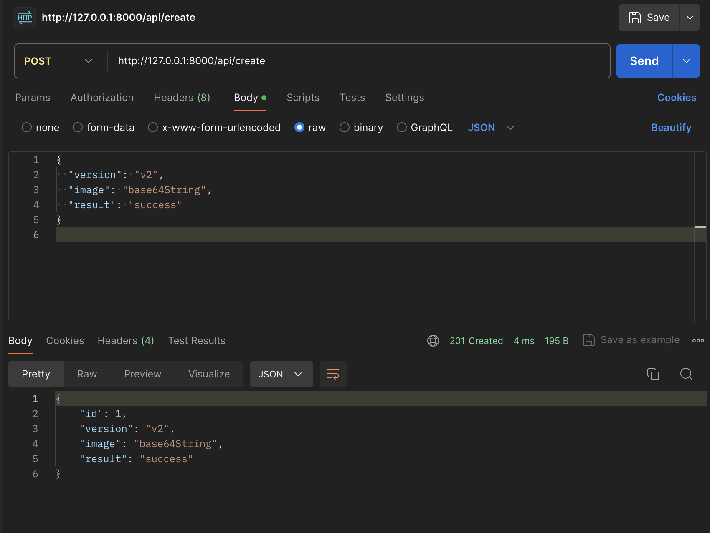
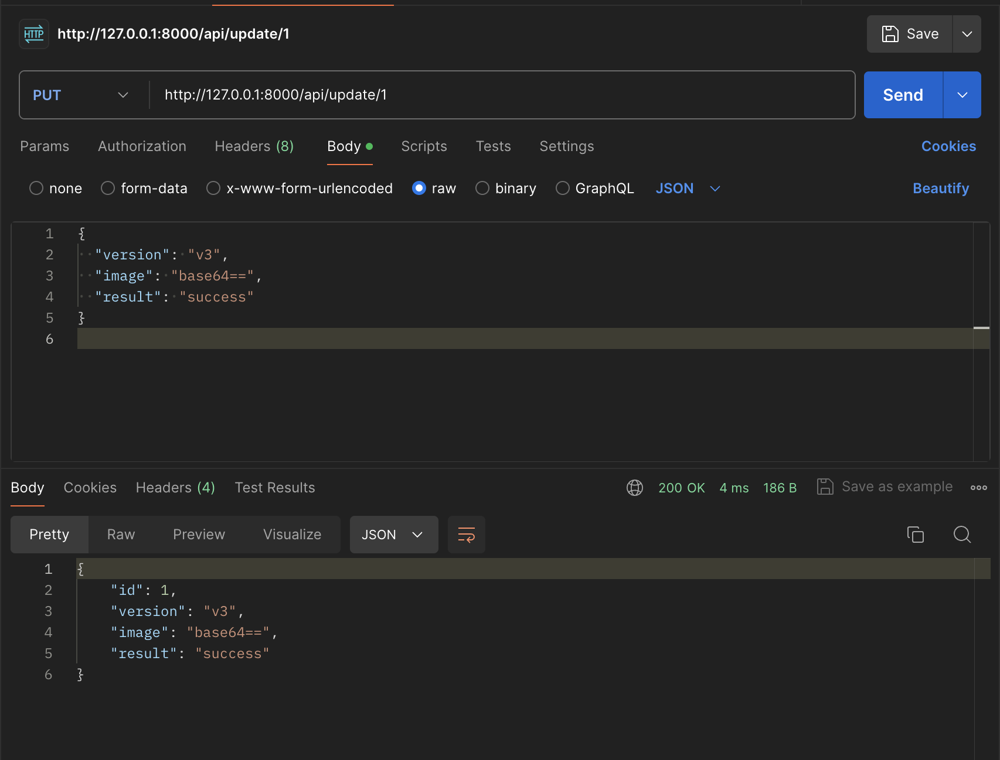
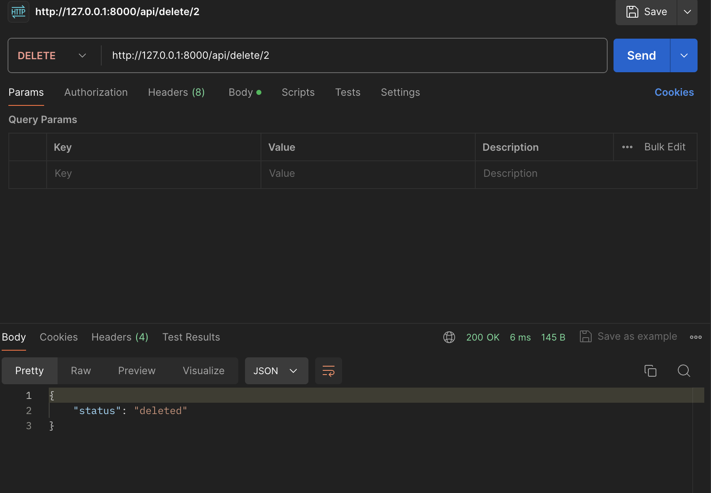
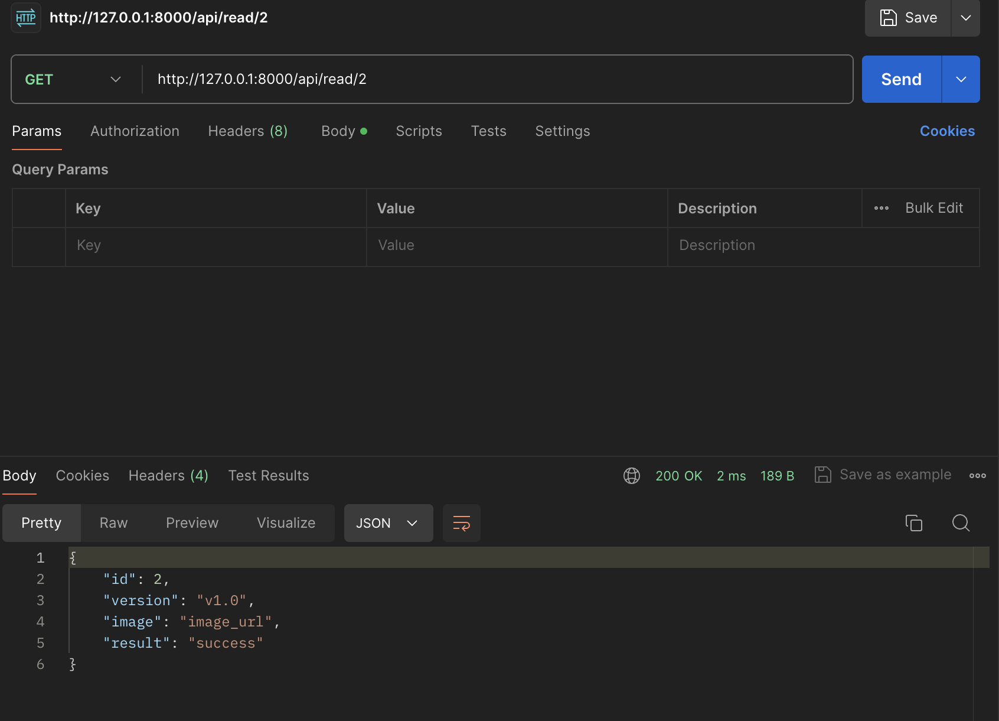

# **Introdução**

Durante a Sprint 4, nossa equipe iniciou o desenvolvimento do backend da aplicação, que desempenhará um papel crucial no armazenamento de imagens dos tubos entupidos após o processamento pela Inteligência Artificial (I.A). A implementação desse backend visa fornecer aos funcionários da Atvos um acesso facilitado a essas imagens, permitindo uma análise precisa para verificar se os tubos realmente estão obstruídos. Esse processo não só melhora a eficiência na identificação de problemas, como também facilita a tomada de decisões rápidas e informadas sobre a necessidade de manutenção.

Além de servir como uma ferramenta de verificação imediata, o backend tem um papel vital no aprimoramento contínuo da I.A. As imagens armazenadas no banco de dados serão usadas para aumentar o conjunto de dados de treinamento da I.A, melhorando sua capacidade de identificar tubos entupidos com maior precisão. Com uma base de dados robusta e diversificada, a I.A poderá aprender com diferentes tipos de obstruções e condições dos tubos, o que resultará em uma maior acurácia e eficiência na detecção de problemas futuros.

O projeto principal envolve o desenvolvimento de um robô especializado em detectar sujeira nos tubos do reboiler. Equipado com uma câmera e algoritmos de I.A., o robô inspeciona os tubos, captura imagens e identifica possíveis obstruções. Essas imagens são então processadas e armazenadas no banco de dados através do backend que estamos desenvolvendo. Esse sistema integrado não apenas permite uma análise detalhada e eficiente por parte dos funcionários, mas também contribui significativamente para o contínuo aprimoramento da tecnologia de I.A., garantindo uma manutenção mais eficaz e uma operação mais suave na planta da Atvos.

## **Tecnologias**

Durante o desenvolvimento do backend, implementamos várias tecnologias avançadas para aprimorar a funcionalidade e a eficiência do nosso projeto. Entre as principais tecnologias utilizadas, destacam-se:

### 1. FastAPI
   - Utilizada para estabelecer a conexão com a base de dados e fornecer uma interface eficiente e robusta para a comunicação.
   - Escolhemos FastAPI devido ao seu alto desempenho e facilidade na criação de APIs rápidas e seguras.

### 2. TinyDB
   - Implementada como a base de dados para armazenar as imagens e metadados associados aos tubos entupidos.
   - TinyDB é uma solução leve e simples, ideal para a manipulação de dados e integração direta com a FastAPI.

Essas tecnologias foram fundamentais para garantir a eficiência na comunicação entre o backend e a base de dados, além de proporcionar uma solução de armazenamento de dados leve e eficaz.

:::info
As tecnologias referentes a outros serviços estarão em suas respectivas partes desta documentação.
:::

## **Desenvolvimento do Backend**

Para o desenvolvimento do backend, utilizamos tecnologias avançadas para garantir uma solução robusta e eficiente. O processo de criação envolveu várias etapas importantes:

### 1. Configuração do Ambiente de Desenvolvimento
   - Inicialmente, configuramos o ambiente de desenvolvimento utilizando ferramentas modernas para assegurar uma estrutura básica e eficiente.
   - Instalamos todas as dependências essenciais, incluindo bibliotecas adicionais que facilitam o desenvolvimento e a integração com outras tecnologias.

### 2. Utilização do FastAPI
   - Escolhemos FastAPI para estabelecer a conexão com a base de dados e fornecer uma interface eficiente e robusta para a comunicação.
   - A FastAPI foi configurada para criar APIs rápidas, seguras e de alto desempenho, facilitando a integração com outros componentes do sistema.

### 3. Implementação do TinyDB
   - Optamos pelo TinyDB como a base de dados para armazenar as imagens e metadados associados aos tubos entupidos.
   - O TinyDB, sendo uma solução leve e simples, foi ideal para a manipulação de dados e integração direta com a FastAPI, garantindo eficiência no armazenamento e recuperação de dados.

### 3.1 Justificando o Uso do TinyDB

#### Visão Geral do TinyDB:
O TinyDB é um banco de dados orientado a documentos, leve, que armazena dados em formato JSON. Ele é especialmente adequado para aplicações de pequena escala, prototipagem e cenários onde um banco de dados SQL tradicional não caberia.

#### Razões para Usar o TinyDB:

1. **Armazenamento de Imagens em Base64**:
   - **Justificativa Principal**: Não é recomendado armazenar imagens em formato Base64 diretamente em um banco de dados SQL tradicional, pois isso pode levar a problemas de desempenho e gerenciamento de dados. O TinyDB, por armazenar dados em JSON, é mais adequado para este tipo de uso.
   - **Vantagem**: O armazenamento de dados em JSON permite que as imagens em Base64 sejam facilmente gerenciadas, acessadas e manipuladas sem os desafios e limitações que surgem com bancos de dados relacionais.


2. **Integração com Python**:
   - TinyDB é escrito em Python e integra-se perfeitamente com aplicações Python.
   - Suporta consultas e manipulações de dados de maneira Pythônica.

#### Campos do Banco de Dados:

1. **ID**:
   - **Propósito**: Identifica unicamente cada entrada de imagem no banco de dados.
   - **Justificativa**: Garante que cada registro possa ser referenciado individualmente, permitindo a recuperação, atualização e exclusão eficientes.

2. **Versão do Modelo**:
   - **Propósito**: Indica a versão do modelo que foi usada para analisar a imagem.
   - **Justificativa**: Importante para rastrear e validar os resultados, especialmente quando os modelos são atualizados ou modificados. Ajuda na comparação do desempenho de diferentes versões do modelo.

3. **Status**:
   - **Propósito**: Registra se um tubo e/ou detritos foram detectados na imagem.
   - **Justificativa**: Permite a consulta e filtragem rápida das imagens com base nos resultados da detecção. É essencial para analisar o desempenho do modelo e para etapas de processamento adicionais que dependem dos resultados da detecção.

4. **Imagem (Base64)**:
   - **Propósito**: Armazena os dados da imagem em formato codificado Base64.
   - **Justificativa**: A codificação Base64 permite que dados binários de imagem sejam armazenados como texto, tornando-os compatíveis com JSON e garantindo que possam ser facilmente armazenados e recuperados do banco de dados. Também facilita a exibição e transmissão de imagens em aplicações web.

### 4. Estruturação do Projeto
   - Organizamos o backend em módulos bem definidos, garantindo que cada parte do sistema fosse independente e reutilizável.
   - Essa modularidade facilita a manutenção do código e a implementação de novas funcionalidades no futuro.

### 5. Desenvolvimento de Funcionalidades Críticas
   - Implementamos funcionalidades essenciais para o armazenamento seguro e eficiente das imagens e metadados dos tubos entupidos.
   - Desenvolvemos mecanismos para garantir a integridade dos dados e a eficiência na recuperação das informações armazenadas.

A criação do backend com FastAPI e TinyDB resultou em uma solução robusta e eficiente, capaz de atender às necessidades específicas do projeto e proporcionar uma base sólida para o desenvolvimento de funcionalidades adicionais no futuro.

:::info
O projeto foi criado levando em consideração a **escalabilidade** do código, permitindo fácil manutenção e expansão.
:::

## **API Endpoints**

### 1. Processar Imagem

**Endpoint:** `http://http://127.0.0.1:8000/api/process_image`

**Método:** `POST`

**Descrição:** Envia uma imagem ao backend, processa a mesma utilizando o modelo YOLO pré treinado com o dataset específico e retorna a imagem anotada e os resultados da detecção na página /result.

:::warning
Para saber mais a respeito do treinamento do modelo Yolo junto de nosso dataset específico veja a [**documentação**](./Yolo.md) a respeito da mesma.
:::

**Parâmetros:**

- `image` (string, obrigatório): Imagem em formato de codificação base64 a ser processada.

:::info
A imagem é transformada em uma String base64 afim de ser tanto "légivel" quanto puder ser transportada. Para saber mais a respeito de base64, clique [**aqui**](https://pt.wikipedia.org/wiki/Base64)

`OBS: A string em codificação base64 é reconhecida por ter os caracters == em seu final`
:::

**Exemplo de Requisição:**

```json
{
  "image": "String em formato base64 da imagem"
}
```

***Exemplo de resposta:**

```json
{
  "processed_image": "String em formato base64 da imagem processada",
  "results": [
    {
      "class": 0,
      "label": "dirt",
      "confidence": 0.99,
      "box": {
        "x_center": 320,
        "y_center": 240,
        "width": 100,
        "height": 200
      }
    }
  ]
}
```

### 2. Operações CRUD

Foi desenvolvido para a aplicação também operações CRUD afim de ter o poder de alterar a base de dados, alterando algum registro, adicionando um novo, deletando algum registro e, ler algum registro específico.

#### Adicionar dados

**Endpoint:** `http://http://127.0.0.1:8000/api/create`

**Método:** `POST`

**Descrição:** Adiciona um novo registro ao banco de dados.

**Parâmetros:** 

- `version`(string, obrigatório): Versão da imagem.
- `image` (string, obrigatório): Imagem do tubo processada.
- `result` (string, obrigatório): Resultado após processamento da imagem (`True` ou `False` dependendo se o tubo está sujo ou não).

**Exemplo de requisição:**

```json
{
  "version": "1.0",
  "image": "String em formato base64 da imagem",
  "result": "True/False"
}
```

**Exemplo de resposta:**

```json
{
  "id": 1,
  "version": "1.0",
  "image": "String em formato base64 da imagem",
  "result": "True/False"
}
```

#### Teste com Postman

Segue abaixo uma imagem do mesmo endpoint testado utilizando o Postman



#### Atualizar dado

**Endpoint:** `http://http://127.0.0.1:8000/api/update/{id}`

**Método:** `PUT`

**Descrição:** Atualiza um registro já existente no banco de dados.

**Parâmetros:** 

- `id`(inteiro, obrigatório): ID do registro
- `version`(string, obrigatório): Versão da imagem.
- `image` (string, obrigatório): Imagem do tubo processada.
- `result` (string, obrigatório): Resultado após processamento da imagem (`True` ou `False` dependendo se o tubo está sujo ou não).

**Exemplo de requisição:**

```json
{
  "version": "1.0",
  "image": "String em formato base64 da imagem",
  "result": "True/False"
}
```

**Exemplo de resposta:**

```json
{
  "id": 1,
  "version": "1.0",
  "image": "String em formato base64 da imagem",
  "result": "True/False"
}
```

:::info Observação
A resposta no endpoint de atualizar registro retornará o registro já atualizado, logo a requisição e resposta serão **iguais**
:::



#### Deletar dado

**Endpoint:** `http://http://127.0.0.1:8000/api/delete/{id}`

**Método:** `DELETE`

**Descrição:** Deleta um registro já existente no banco de dados.

**Parâmetros:** 

- `id`(inteiro, obrigatório): ID do registro

**Exemplo de resposta:**

```json
{
   "message": "Registro deletado com sucesso.",
}
```



#### Ler dado

**Endpoint:** `http://http://127.0.0.1:8000/api/read/{id}`

**Método:** `GET`

**Descrição:** Retorna os dados de um registro específico.

**Parâmetros:** 

- `id`(inteiro, obrigatório): ID do registro

**Exemplo de resposta:**

```json

{
  "id": 1,
  "version": "1.0",
  "image": "String em formato base64",
  "result": "True/False"
}
```



## **Estruturação do backend**

Afim de deixar o backend o mais otimizado possível e garantir a escalabilidade com o mesmo, podendo ser facilmente alterado futuramente, foi escolhida a seguinte estrutura para o mesmo.

USAR TREE COMANDO

Dentro desta estrutura, temos alguns arquivos importantes, como os controladores e roteadores, abaixo os mesmos serão melhor explicados.

### 1. Controladores

Controladores, no contexto do desenvolvimento de aplicações web e APIs, são componentes responsáveis por lidar com a lógica de negócios e a manipulação de dados. Eles atuam como intermediários entre os roteadores, que recebem as requisições dos clientes, e os modelos ou bancos de dados, onde os dados são armazenados. Os controladores processam as requisições, executam operações específicas, aplicam regras de negócios e retornam as respostas apropriadas.

**Por que são úteis?**

- **Separação de Responsabilidades:** Ao separar a lógica de negócios dos roteadores e modelos, os controladores ajudam a manter o código mais organizado e modular.
- **Reutilização de Código:** Funções comuns podem ser reutilizadas em diferentes partes da aplicação, evitando duplicação de código.
- **Facilidade de Manutenção:** Com a lógica de negócios centralizada em controladores, fica mais fácil localizar e corrigir erros, bem como implementar novas funcionalidades.
- **Testabilidade:** Controladores são mais fáceis de testar isoladamente, garantindo que a lógica de negócios funcione conforme o esperado sem interferências externas.

#### 1. Processamento de Imagem

Este controlador é responsável por processar imagens usando o modelo YOLO. Ele decodifica a imagem base64 recebida, executa a inferência do YOLO e retorna a imagem anotada e os resultados da detecção.

1. **Decodificação da Imagem Base64**: Converte a string base64 recebida para um formato de imagem utilizável.
2. **Inferência com YOLO**: Utiliza o modelo YOLO para detectar objetos na imagem.
3. **Anotação da Imagem**: Gera uma imagem anotada com as detecções.
4. **Codificação da Imagem Anotada**: Converte a imagem anotada de volta para base64.
5. **Salvamento dos Resultados**: Armazena os resultados da inferência no banco de dados TinyDB.

#### Estrutura do Arquivo:

```python
import base64
import cv2
import numpy as np
import json
from fastapi import HTTPException
from pydantic import BaseModel
from ultralytics import YOLO
import tinydb

# Carregar o modelo YOLO
model = YOLO("best.pt")

# Inicializar o banco de dados
db = tinydb.TinyDB("../database/db.json")
User = tinydb.Query()

# Função para converter resultados para JSON
def results_to_json(results, model):
    detections = []
    for result in results:
        for box in result.boxes:
            detection = {
                "class": int(box.cls),
                "label": model.names[int(box.cls)],  # Adiciona a label ao JSON
                "confidence": float(box.conf),
                "box": {
                    "x_center": float(box.xywh[0][0]),
                    "y_center": float(box.xywh[0][1]),
                    "width": float(box.xywh[0][2]),
                    "height": float(box.xywh[0][3]),
                },
            }
            detections.append(detection)
    return json.dumps(detections, indent=4)

class ImageData(BaseModel):
    image: str

async def process_image(data: ImageData):
    try:
        # Decodificar a imagem base64
        image_data = base64.b64decode(data.image)
        np_arr = np.frombuffer(image_data, np.uint8)
        image = cv2.imdecode(np_arr, cv2.IMREAD_COLOR)
        
        # Verificar se a imagem foi carregada corretamente
        if image is None:
            raise HTTPException(status_code=400, detail="Erro ao carregar a imagem.")

        # Executar inferência com YOLO na imagem
        results = model(image)

        # Anotar a imagem
        annotated_image = results[0].plot()

        # Codificar a imagem anotada para base64
        _, buffer = cv2.imencode('.jpg', annotated_image)
        annotated_image_base64 = base64.b64encode(buffer).decode('utf-8')

        # Converter resultados para JSON
        results_json = results_to_json(results, model)

        # Salvar os resultados no banco de dados
        new_entry = {
            "version": "1.0",
            "image": annotated_image_base64,
            "result": results_json
        }
        db.insert(new_entry)
        
        return {"processed_image": annotated_image_base64, "results": results_json}
    except Exception as e:
        raise HTTPException(status_code=400, detail=str(e))
```

#### Comentários a respeito do código

- **Importações:** Importa bibliotecas essenciais como `base64` para manipulação de strings base64, `cv2` para operações com imagens, `numpy` para manipulação de arrays, `json` para manipulação de JSON, `HTTPException` para tratamento de exceções HTTP no FastAPI, `BaseModel` do Pydantic para validação de dados, `YOLO` da biblioteca ultralytics para carregar o modelo de detecção de objetos, e `tinydb` para operações no banco de dados.
- **Carregamento do Modelo YOLO:** `model = YOLO("best.pt")` carrega o modelo YOLO treinado.
- **Inicialização do Banco de Dados:** `db = tinydb.TinyDB("../database/db.json")` inicializa o banco de dados TinyDB e `User = tinydb.Query()` permite consultas no banco de dados.
- **Função results_to_json:** Converte os resultados da inferência do YOLO para JSON. Cada detecção é armazenada com a classe, rótulo, confiança e coordenadas da caixa delimitadora.
- **Classe ImageData:** Define o esquema de dados para a imagem recebida, contendo uma string base64.
- **Função process_image:**
   - Decodifica a imagem base64.
   - Verifica se a imagem foi carregada corretamente.
   - Executa a inferência do YOLO na imagem.
   - Anota a imagem com as detecções.
   - Codifica a imagem anotada de volta para base64.
   - Converte os resultados da inferência para JSON.
   - Salva os resultados no banco de dados.
   - Retorna a imagem processada e os resultados.

#### 2. Operação CRUD

Operações CRUD são as operações de (Create, Read, Update e Delete), as mesmas são úteis pois oferecem a alteração da base de dados.

##### 2.1 Criar

Este controlador é responsável por criar novas entradas no banco de dados. Ele gera um novo ID, insere os dados fornecidos e retorna a nova entrada.

##### Estrutura do arquivo

```python
import tinydb

# Inicializa o banco de dados TinyDB
db = tinydb.TinyDB("../database/db.json")

# Função para obter o próximo ID disponível
def get_next_id():
    try:
        max_id = max(item.get('id', 0) for item in db.all())
        return max_id + 1
    except ValueError:
        return 1

# Função assíncrona para criar uma nova entrada no banco de dados
async def create(version, image, result):
    try:
        id = get_next_id()
        db.insert({"id": id, "version": version, "image": image, "result": result})
        return {"id": id, "version": version, "image": image, "result": result}
    except Exception as e:
        return {"error": str(e)}
```

##### Comentários sobre o código

- **Importações:** Importa a biblioteca `tinydb` para operações no banco de dados.
- **Inicialização do Banco de Dados:** `db = tinydb.TinyDB("../database/db.json")` inicializa o banco de dados TinyDB.
- **Função get_next_id:** Calcula o próximo ID disponível no banco de dados. Se o banco estiver vazio, retorna 1.
- **Função create:**
   - Obtém o próximo ID disponível.
   - Insere uma nova entrada no banco de dados com os dados fornecidos.
   - Retorna a nova entrada criada.

##### 2.2 Ler informações

Este controlador é responsável por ler uma entrada específica no banco de dados pelo seu ID.

##### Estrutura do arquivo

```python
import tinydb

# Inicializa o banco de dados TinyDB
db = tinydb.TinyDB("../database/db.json")
User = tinydb.Query()

# Função assíncrona para ler uma entrada específica do banco de dados pelo ID
async def read(id):
    try:
        result = db.search(User.id == id)
        if result:
            return result[0]
        else:
            return {"error": "User not found"}
    except Exception as e:
        return {"error": str(e)}
```

##### Comentários sobre o código

- **Importações:** Importa a biblioteca `tinydb` para operações no banco de dados.
- **Inicialização do Banco de Dados:** `db = tinydb.TinyDB("../database/db.json")` inicializa o banco de dados TinyDB e `User = tinydb.Query()` permite consultas no banco de dados.
- **Função read:**
   - Procura uma entrada no banco de dados com o ID fornecido.
   - Se encontrado, retorna a entrada correspondente.
   - Se não encontrado, retorna um dicionário de erro.

##### 2.3 Atualizar algum registro

Este controlador é responsável por atualizar uma entrada específica no banco de dados pelo seu ID.

##### Estrutura do arquivo

```python
import tinydb

# Inicializa o banco de dados TinyDB
db = tinydb.TinyDB("../database/db.json")
User = tinydb.Query()

# Função assíncrona para atualizar uma entrada específica do banco de dados pelo ID
async def update(id, version, image, result):
    try:
        db.update({'version': version, 'image': image, 'result': result}, User.id == id)
        return {"id": id, "version": version, "image": image, "result": result}
    except Exception as e:
        return {"error": str(e)}
``` 

##### Comentários sobre o código

- **Importações:** Importa a biblioteca `tinydb` para operações no banco de dados.
- **Inicialização do Banco de Dados:** `db = tinydb.TinyDB("../database/db.json")` inicializa o banco de dados TinyDB e `User = tinydb.Query()` permite consultas no banco de dados.
- **Função update:**
   - Atualiza uma entrada no banco de dados com o ID fornecido.
   - Retorna a entrada atualizada.
   - Em caso de erro, retorna um dicionário com a mensagem de erro.

##### 2.4 Deletar registro

Este controlador é responsável por deletar uma entrada específica no banco de dados pelo seu ID.

##### Estrutura do arquivo

```python
import tinydb

# Inicializa o banco de dados TinyDB
db = tinydb.TinyDB("../database/db.json")
User = tinydb.Query()

# Função assíncrona para deletar uma entrada específica do banco de dados pelo ID
async def delete(id):
    try:
        db.remove(User.id == id)
        return {"message": "User deleted successfully"}
    except Exception as e:
        return {"error": str(e)}
```

##### Comentários sobre o código

- **Importações:** Importa a biblioteca `tinydb` para operações no banco de dados.
- **Inicialização do Banco de Dados:** `db = tinydb.TinyDB("../database/db.json")` inicializa o banco de dados TinyDB e `User = tinydb.Query()` permite consultas no banco de dados.
- **Função delete:**
   - Remove uma entrada no banco de dados com o ID fornecido.
   - Retorna uma mensagem de sucesso.
   - Em caso de erro, retorna um dicionário com a mensagem de erro.

#### Conclusão Controladores

Os controladores são componentes essenciais na estrutura da aplicação, responsáveis por realizar operações específicas, como processamento de imagens e operações CRUD. Comentários no código ajudam a entender a lógica e o fluxo das operações, facilitando a manutenção e a expansão da aplicação. Além disso, controladores promovem uma melhor organização e modularidade, tornando o desenvolvimento mais eficiente e escalável.

### 2. Roteadores (Routers)

Roteadores (ou Routers) no contexto do FastAPI são componentes essenciais que definem e organizam os endpoints da API. Eles ajudam a estruturar e modularizar a aplicação, permitindo uma separação lógica dos diferentes pontos de entrada da API. Ao utilizar roteadores, podemos agrupar endpoints relacionados em um único módulo, o que facilita a manutenção, a escalabilidade e a expansão do código. Além disso, roteadores ajudam a manter o código mais limpo e organizado, tornando mais fácil para os desenvolvedores navegarem e compreenderem a estrutura da aplicação.

**Vantagens de usar roteadores:**

- **Modularidade:** Permite dividir a aplicação em módulos menores e mais gerenciáveis.
- **Organização:** Facilita a organização dos endpoints da API de maneira lógica.
- **Manutenção:** Simplifica a manutenção e atualização do código, pois cada módulo pode ser modificado independentemente.
- **Reutilização:** Promove a reutilização de código, permitindo que funcionalidades comuns sejam agrupadas em roteadores dedicados.

Segue abaixo os roteadores utilizados neste projeto específico.

:::info
Para suprir todas as necessidades até então foram utilizados apenas 2 roteadores, porém futuramente poderão ser adicionados novos.
:::

#### 1. Roteador de imagens (`routers/image_router.py`)

O roteador de imagens (`image_router.py`) define as rotas necessárias para o processamento de imagens usando o modelo YOLO. Ele utiliza a função `process_image` do controlador de imagens (`controllers/image_controller.py`).

#### Estrutura do arquivo

```python
from fastapi import APIRouter, HTTPException, Body
from controllers.image_controller import process_image, ImageData

# Inicializa o roteador de imagens
router = APIRouter()

@router.post("/process_image", status_code=200)
async def process_image_endpoint(data: ImageData = Body(...)):
    """
    Endpoint para processar imagens.
    Recebe os dados da imagem e retorna o resultado do processamento.
    """
    try:
        return await process_image(data)
    except Exception as e:
        raise HTTPException(status_code=500, detail=str(e))

```

#### Comentários a respeito do código

- **Importações:** Importa `APIRouter` para criar um roteador, `HTTPException` para lidar com exceções HTTP e `Body` para declarar parâmetros no corpo da requisição. Também importa `process_image` e `ImageData` do controlador de imagens.
- **Inicialização do Roteador:** `router = APIRouter()` inicializa um novo roteador.
- **Função process_image_endpoint:** Define um endpoint que utiliza a função `process_image` para processar dados de imagem recebidos no corpo da requisição. Em caso de erro, lança uma exceção HTTP com status 500.

#### 2. Roteador CRUD

O roteador CRUD (`crud_router.py`) define as rotas necessárias para as operações CRUD (Create, Read, Update, Delete). Ele utiliza as funções `create`, `read`, `update` e `delete` dos controladores localizados na pasta `controllers/crud`.

#### Estrutura do arquivo

```python
from fastapi import APIRouter, HTTPException, Query, Body
from controllers.crud.create import create
from controllers.crud.read import read
from controllers.crud.update import update
from controllers.crud.delete import delete

# Inicializa o roteador CRUD
router = APIRouter()

@router.post("/create", status_code=201)
async def create_by_id(version: str = Body(...), image: str = Body(...), result: str = Body(...)):
    """
    Endpoint para criar um novo registro.
    Recebe os dados necessários e retorna o registro criado.
    """
    try:
        return await create(version, image, result)
    except Exception as e:
        raise HTTPException(status_code=500, detail=str(e))

@router.get("/read/{id}", status_code=200)
async def read_by_id(id: int):
    """
    Endpoint para ler um registro existente.
    Recebe o ID do registro e retorna os dados correspondentes.
    """
    try:
        return await read(id)
    except Exception as e:
        raise HTTPException(status_code=500, detail=str(e))

@router.put("/update/{id}", status_code=200)
async def update_by_id(id: int, version: str = Body(...), image: str = Body(...), result: str = Body(...)):
    """
    Endpoint para atualizar um registro existente.
    Recebe o ID do registro e os novos dados, retornando o registro atualizado.
    """
    try:
        return await update(id, version, image, result)
    except Exception as e:
        raise HTTPException(status_code=500, detail=str(e))

@router.delete("/delete/{id}", status_code=200)
async def delete_by_id(id: int):
    """
    Endpoint para deletar um registro existente.
    Recebe o ID do registro e remove-o do sistema.
    """
    try:
        return await delete(id)
    except Exception as e:
        raise HTTPException(status_code=500, detail=str(e))
```

#### Comentários sobre o Código

- **Importações:** Importa `APIRouter` para criar um roteador, `HTTPException` para lidar com exceções HTTP, `Query` e `Body` para declarar parâmetros nas requisições. Também importa as funções `create`, `read`, `update` e `delete` dos controladores CRUD.
- **Inicialização do Roteador:** `router = APIRouter()` inicializa um novo roteador.
- **Função create_by_id:** Define um endpoint para criar um novo registro. Recebe dados no corpo da requisição e tenta criar o registro usando a função `create`. Em caso de erro, lança uma exceção HTTP com status 500.
- **Função read_by_id:** Define um endpoint para ler um registro existente pelo ID. Tenta ler o registro usando a função `read`. Em caso de erro, lança uma exceção HTTP com status 500.
- **Função update_by_id:** Define um endpoint para atualizar um registro existente pelo ID. Recebe dados no corpo da requisição e tenta atualizar o registro usando a função `update`. Em caso de erro, lança uma exceção HTTP com status 500.
- **Função delete_by_id:** Define um endpoint para deletar um registro existente pelo ID. Tenta deletar o registro usando a função `delete`. Em caso de erro, lança uma exceção HTTP com status 500.

#### Conclusão Roteadores

Os roteadores são componentes fundamentais no desenvolvimento de APIs com FastAPI, oferecendo uma maneira eficiente de organizar e gerenciar os diferentes pontos de entrada da aplicação. Ao dividir a aplicação em módulos lógicos, eles facilitam a manutenção, expansão e entendimento do código, além de promoverem a reutilização e a modularidade.

## **Conclusão**

O desenvolvimento de um backend robusto e eficiente é essencial para garantir que a aplicação atenda às necessidades de armazenamento e processamento de dados de maneira eficaz. Ao utilizar tecnologias avançadas como FastAPI e TinyDB, conseguimos criar uma estrutura modular e escalável que não apenas facilita a manutenção e a expansão futuras, mas também assegura uma comunicação eficiente entre os diferentes componentes do sistema.

A implementação dos roteadores e controladores, separados por responsabilidades específicas, demonstra a importância da organização e modularidade no desenvolvimento de software. Com essa abordagem, a aplicação se torna mais fácil de entender, manter e expandir, além de garantir que a lógica de negócios esteja claramente definida e separada das preocupações de roteamento e armazenamento de dados.

O sistema desenvolvido não apenas melhora a eficiência na detecção de problemas nos tubos do reboiler, mas também contribui significativamente para o aprimoramento contínuo da Inteligência Artificial utilizada. As imagens armazenadas e processadas pelo backend serão fundamentais para treinar e melhorar a precisão do modelo de I.A., resultando em uma operação mais suave e eficaz na planta da Atvos. Em suma, o projeto demonstra como a combinação de tecnologias modernas e uma arquitetura bem planejada pode resultar em uma solução poderosa e eficiente para desafios complexos de engenharia.

### Impacto na qualidade do projeto

A qualidade do projeto foi significativamente aprimorada pela adoção de uma abordagem estruturada e pelo uso de tecnologias de ponta. A implementação de FastAPI e TinyDB não só assegurou uma comunicação rápida e segura entre o backend e a base de dados, mas também garantiu que o sistema fosse leve e de fácil integração. Esta escolha tecnológica resultou em um backend ágil, capaz de processar e armazenar dados de maneira eficiente.

Além disso, a separação clara entre roteadores e controladores permitiu uma melhor organização do código, facilitando a manutenção e a adição de novas funcionalidades. A modularidade do projeto assegura que futuras expansões e melhorias possam ser implementadas sem grandes reestruturações, garantindo a escalabilidade da solução.

Outro ponto crucial foi a capacidade do sistema de utilizar as imagens processadas para melhorar o treinamento da Inteligência Artificial. Isso não só aumenta a precisão da detecção de obstruções nos tubos, mas também contribui para o desenvolvimento contínuo de uma tecnologia mais inteligente e eficiente. A coleta e armazenamento de dados robustos proporcionam uma base sólida para a análise e melhoria contínua, elevando o padrão de qualidade do projeto como um todo.

Em resumo, a combinação de uma arquitetura bem planejada, tecnologias avançadas e uma clara separação de responsabilidades não apenas melhora a eficiência operacional do projeto, mas também garante um impacto positivo na qualidade e na capacidade de evolução da solução desenvolvida.

:::danger Aviso
Lembrando, todas as instruções de como iniciar este backend e o projeto inteiro estarão em sua respectiva parte na área de **Instruções de Execução**
:::
