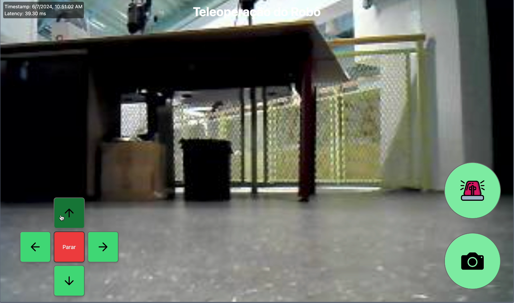

# Metodologia geral

## Introdução

Neste documento, nossa intenção é detalhar meticulosamente todos os passos e procedimentos realizados ao longo do projeto para a Atvos, da Sprint 1 até a Sprint 5 da entrega do projeto. Além disso, apresentaremos uma metodologia abrangente que abarca desde a concepção inicial até a implementação prática das soluções propostas. Este documento visa não apenas registrar, mas também analisar cada fase do projeto de forma a proporcionar uma visão completa e detalhada de todas as etapas envolvidas.

:::info
A metodologia detalhada de cada sprint pode ser encontrada em suas respectivas seções
:::

## Tecnologias Utilizadas

A seguir, tem-se as metodologias utilizadas no projeto final.

### 1. Modelagem de Dados e Preparação do Dataset

#### Roboflow

Para a preparação e organização do dataset de imagens dos tubos obstruídos, recorremos ao Roboflow, uma plataforma para anotação de dados e pré-processamento de imagens. Utilizamos integralmente os recursos do Roboflow para sintetizar e preparar nosso dataset, garantindo assim a qualidade e a integridade dos dados utilizados no treinamento do modelo YoloV8.

Vale destacar que todas as imagens presentes no dataset foram capturadas e preparadas por nossa equipe, levando em consideração as especificações detalhadas fornecidas pela Atvos. Cada imagem foi selecionada e processada para garantir que representem de forma precisa as condições reais dos tubos obstruídos, conforme solicitado pelo cliente.

Pode ser visto com mais detalhes clicando [aqui](../../../sprint-4/Documentação/Metodologia/Yolo.md#2-roboflow)

### 2. Desenvolvimento do Backend

#### FastAPI

O backend foi desenvolvido utilizando o FastAPI, um framework moderno para a construção rápida de APIs em Python. Esta escolha foi motivada pela necessidade de uma interface robusta e eficiente para integrar o modelo de detecção com o sistema da Atvos. O FastAPI proporciona alta performance e segurança, essenciais para a operação em tempo real na planta industrial.

Pode ser visto com mais detalhes clicando [aqui](../../../sprint-4/Documentação/Metodologia/Backend.md#1-fastapi)

### 3. Treinamento e Implementação do Modelo

#### YoloV8

O modelo YoloV8 foi selecionado devido à sua eficácia comprovada na detecção de objetos em tempo real. Para garantir que o modelo atendesse às especificações exatas do projeto, foi realizado treinamento utilizando um dataset customizado, preparado pelo Roboflow. Este dataset foi elaborado especificamente para capturar as variáveis e condições reais dos tubos obstruídos conforme as diretrizes estabelecidas pela Atvos. O processo de treinamento do YoloV8 incluiu etapas cruciais como a validação e ajuste de parâmetros, garantindo assim que o modelo fosse calibrado para reconhecer e classificar obstruções nos tubos com elevada acurácia.


Pode ser visto com mais detalhes clicando [aqui](../../../sprint-4/Documentação/Metodologia/Yolo.md)

### 4. Gerenciamento de Dados e Armazenamento

#### TinyDB

Para o armazenamento das imagens processadas e resultados da detecção, foi utilizado o TinyDB. Este banco de dados leve e flexível permite a rápida recuperação e análise das imagens, facilitando a tomada de decisões pelos operadores da planta da Atvos.

A imagem no TinyDB é salva da seguinte maneira pelo usuário:


O usuário clica no no botão de câmera.


Após isso, a imagem é mostrada para o usuário, já marcando os locais que estão sujos. E assim, ela é salva no banco de dados, com data e hora e outras informações.

Pode ser visto com mais detalhes clicando [aqui](../../../sprint-4/Documentação/Metodologia/Backend.md)

### 5. Interface de Usuário

#### Frontend com ReactJS

No frontend, foi desenvolvida uma interface intuitiva utilizando ReactJS. Esta escolha proporciona uma experiência de usuário fluida e responsiva, permitindo que os funcionários da Atvos visualizem e analisem as imagens processadas pelo modelo YoloV8 de forma eficiente. Essa mudança foi motivada pela necessidade de proporcionar uma experiência de usuário superior, com uma interface visualmente mais atraente e funcional. O React nos oferece não apenas a capacidade de personalizar cada aspecto da interface, mas também uma estrutura modular que facilita a manutenção e a escalabilidade do projeto, diferente do Streamlit que foi tentada sua implementação na Sprint 3, mas devido sua falta de flexibilidade, foi substituído pelo React.




Pode ser visto com mais detalhes clicando [aqui](../../../sprint-4/Documentação/Metodologia/React.md)

## Metodologia do Projeto

### 1. Planejamento e Estratégia

O projeto foi iniciado com um planejamento detalhado, definindo os objetivos específicos e os requisitos técnicos necessários para a implementação da solução de detecção de obstruções em tubos. Foram realizadas reuniões regulares com as partes interessadas para alinhar expectativas e garantir o sucesso do projeto.

Pode ser visto mais detalhes clicando nos seguinte links: [User-Stories](../../../sprint-1/Metadesign/user-stories.md), [RF e RNF](../../../sprint-1/Arquitetura/rf-e-rnf.md), [Proposta de arquitetura](../../../sprint-1/Arquitetura/proposta_arq.md), [Personas](../../../sprint-1/Metadesign/personas.md), [Matriz de Risco](../../../sprint-1/Entendimento%20do%20negócio/matriz-de-risco.md), [Business Model Canvas](../../../sprint-1/Entendimento%20do%20negócio/BusinessModelCanvas.md), [Arquitetura da Informação](../../../sprint-1/Metadesign/arquitetura-informacao.md)

### 2. Desenvolvimento do Backend

#### Arquitetura e Implementação

A equipe de desenvolvimento projetou uma arquitetura escalável para o backend, utilizando contêineres Docker para facilitar a implantação e manutenção. As APIs foram desenvolvidas com o FastAPI para suportar operações de CRUD (Create, Read, Update, Delete) sobre as imagens processadas pelo YoloV8.

```python
from fastapi import FastAPI, UploadFile, File
from tinydb import TinyDB, Query

app = FastAPI()
db = TinyDB('database.json')
```

O backend completo pode ser visualizado clicando [aqui](../../../sprint-4/Documentação/Metodologia/Backend.md)

### 3. Integração do Modelo YoloV8

#### Treinamento e Ajustes

O modelo YoloV8 foi treinado utilizando GPUs para acelerar o processo de aprendizado. Foram realizados ajustes finos na configuração do modelo para garantir alta precisão na detecção de obstruções nos tubos, considerando as condições específicas da planta da Atvos.

```python
from ultralytics import YOLO

model = YOLO("yolov8.pt")
result = model.train(data="dataset.yaml", epochs=100, device="cuda")
```

A utilização do Yolo pode ser visualizada com mais detalhes clicando [aqui](../../../sprint-4/Documentação/Metodologia/Yolo.md)

### 4. Validação e Testes

#### Testes de Performance

Após o treinamento, o modelo foi submetido a extensivos testes de performance para validar sua eficácia e robustez. Foram analisadas métricas como Precisão, Revocação e Taxa de Falso Positivo para garantir que o YoloV8 atendesse aos padrões de qualidade exigidos pela Atvos.

```python
metrics = model.val()
precision = metrics.precision()
recall = metrics.recall()
false_positive_rate = metrics.false_positive_rate()
```

Os testes a respeito do Yolo podem ser visualizados no seguinte [link](../../../sprint-4/Documentação/Metodologia/Yolo.md) também

### 5. Integração Completa e Operacionalização

#### Backend e Frontend

O modelo treinado foi integrado ao backend desenvolvido com FastAPI, permitindo a análise em tempo real das imagens capturadas pelos robôs de inspeção. Os resultados da detecção foram armazenados no TinyDB e acessados através da interface de usuário desenvolvida em ReactJS.

O backend pode ser visto [aqui](../../../sprint-4/Documentação/Metodologia/Backend.md)

E o Frontend [aqui](../../../sprint-4/Documentação/Metodologia/React.md)

### 6. Monitoramento e Manutenção

#### Garantia de Qualidade

Para garantir a qualidade contínua da solução, foram implementados processos de monitoramento e manutenção regular. Alertas automáticos foram configurados para identificar qualquer anomalia no sistema de detecção de obstruções, garantindo uma resposta rápida e eficaz por parte da equipe de operações da Atvos.

## Resultados

O projeto de detecção de obstruções em tubos utilizando YoloV8 e tecnologias avançadas com o intuito de melhorar a eficiência operacional da planta da Atvos. A capacidade de detectar e corrigir obstruções rapidamente reduzir o tempo de paralisação e aumentar a confiabilidade dos sistemas industriais, além de diminuir custos. A metodologia adotada, combinando o YoloV8 com FastAPI e a usabilidade do ReactJS, estabeleceu uma base sólida para futuras expansões e melhorias na aplicação de inteligência artificial na empresa.

### Impacto na Indústria

Além dos benefícios operacionais diretos, o projeto teve um impacto significativo na cultura organizacional da Atvos, promovendo uma maior adoção de tecnologias de IA e incentivando a inovação contínua. A capacidade de implementar soluções baseadas em dados para problemas complexos de manutenção abre caminho para futuras otimizações em outros processos industriais.

### Desafios Superados

Durante a execução do projeto, alguns desafios foram superados, como a integração inicial do modelo YoloV8 com o ambiente de produção da Atvos e a otimização dos recursos de hardware para treinamento e inferência. A colaboração entre equipes multidisciplinares foi fundamental para resolver esses desafios de maneira eficaz e oportuna.

## Conclusão

O projeto foi realizado com todas as tecnologias aqui apresentadas, com o intuito de uma melhora essencial na limpeza dos tubos durante a operação da Atvos. O projeto contou com a programação completa do robô, utilizando uma câmera e um lidar como instrumentos físicos, inteligência artificial para detectar os resíduos, uma interface para o controle do robô, e toda a parte de backend que entra em contato com todas as partes e salva no banco de dados.

```

Este texto expandido cobre de forma mais detalhada cada aspecto do projeto, desde a escolha das tecnologias até os impactos e futuras direções, proporcionando uma visão abrangente e profunda do processo de detecção de obstruções em tubos utilizando YoloV8.