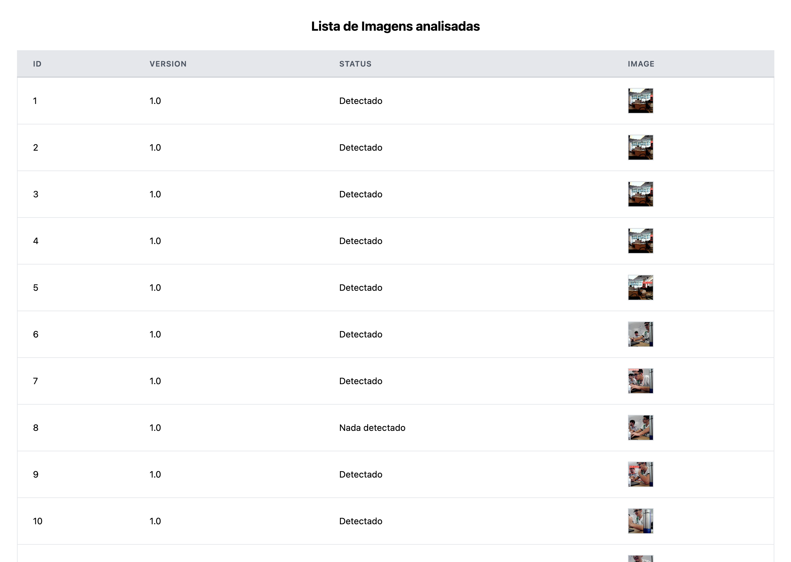

# Introdução

Uma funcionalidade adicionada nessa sprint é uma página onde o usuário pode visualizar uma lista de imagens, juntamente com informações detalhadas sobre cada imagem, como o número da imagem, a versão do modelo que a analisou, e se foram detectados tubos e detritos. A seguir, detalharemos o código que redireciona o usuário para uma página específica onde uma imagem processada é exibida.

## Página
O código a seguir é um componente React chamado `ResultPage. Este componente é responsável por exibir uma imagem processada que foi previamente selecionada ou gerada em uma página anterior da aplicação. Ele utiliza a biblioteca `react-router-dom para obter informações passadas via navegação.

```js
import React from 'react';
import { useLocation } from 'react-router-dom';

const ResultPage = () => {
  // Hook do React Router para acessar o estado passado pela navegação
  const location = useLocation();
  // Extrai a imagem processada do estado
  const { processedImage } = location.state || {};

  // Verifica se há dados da imagem processada
  if (!processedImage) {
    // Se não houver dados, exibe uma mensagem de erro
    return <div>No image data available.</div>;
  }

  return (
    <div className="ResultPage">
      <h1>Processed Image</h1>
      {/* Exibe a imagem processada em formato base64 */}
      
    </div>
  );
};

export default ResultPage;
```

No início do componente `ResultPage`, usamos o hook `useLocation` para obter o estado passado pela navegação. Em seguida, desestruturamos o objeto `location.state` para extrair a propriedade `processedImage` . Se `location.state` for undefined (caso nenhum estado tenha sido passado), `processedImage` será undefined. Verificamos se `processedImage` está definido. Se não estiver, renderizamos um `<div>` com uma mensagem de erro indicando que não há dados de imagem disponíveis. Se processedImage estiver definido, renderizamos um contêiner `<div>` com uma classe `ResultPage`. Dentro deste contêiner, incluímos um título `<h1>` e uma tag `` que exibe a imagem processada. A fonte da imagem (src) é definida como uma string codificada em base64 que representa a imagem JPEG processada.

## Interface


